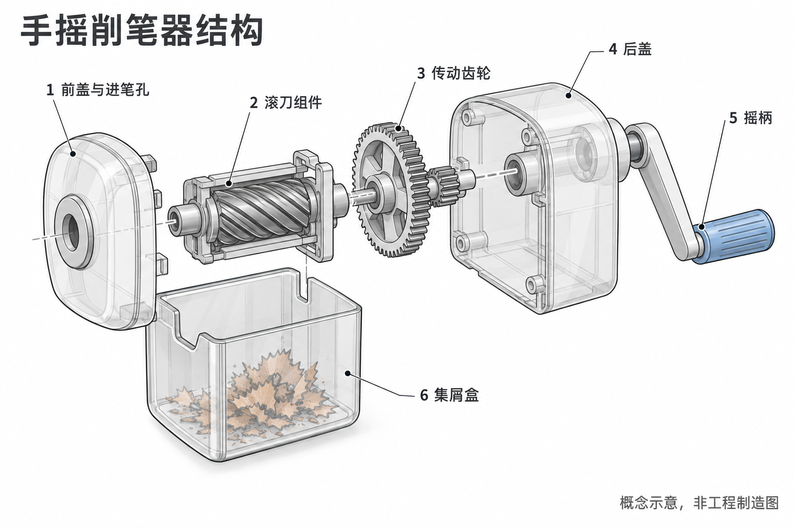
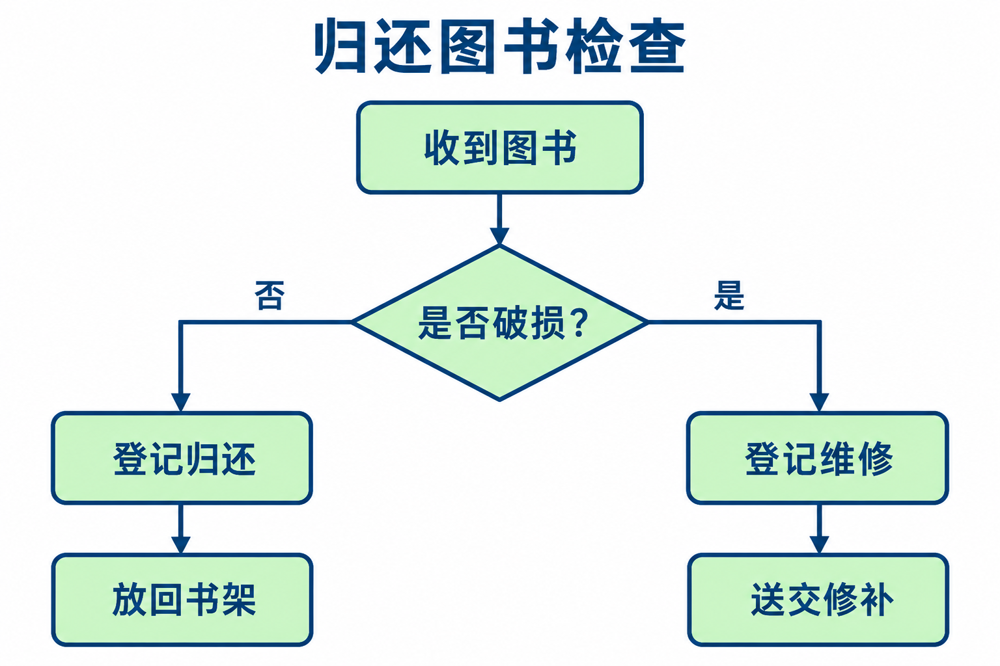
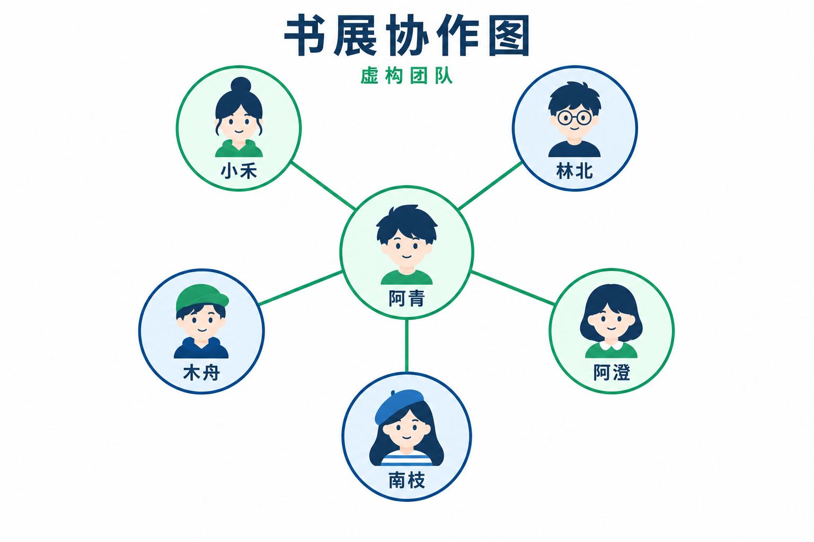
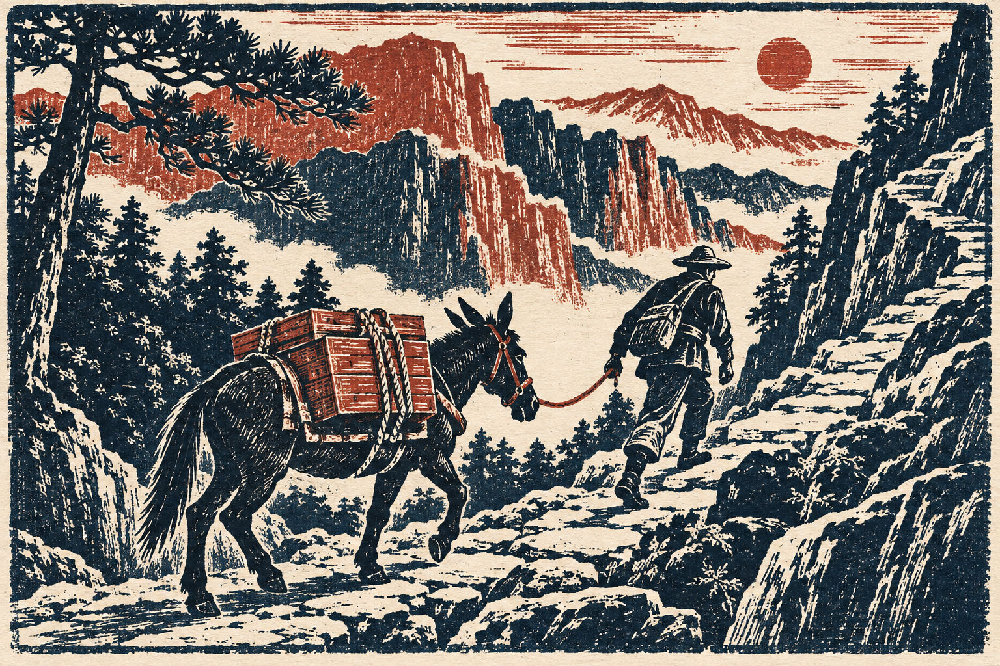
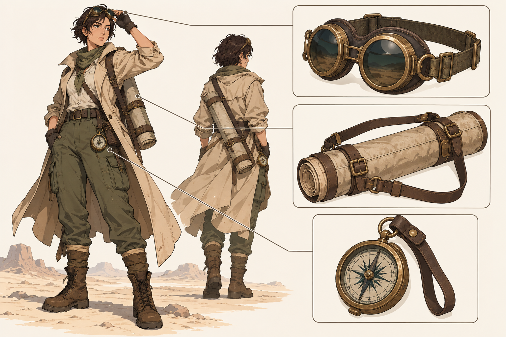
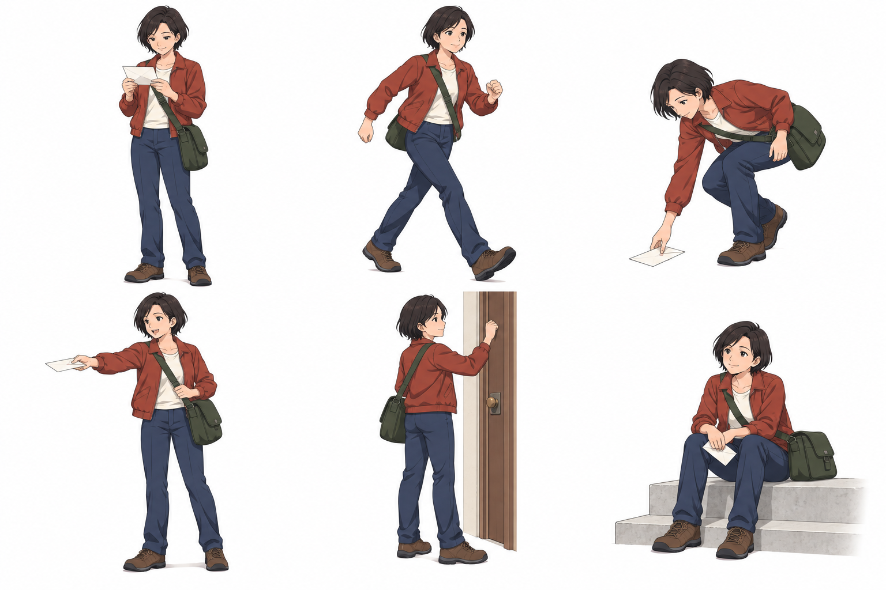
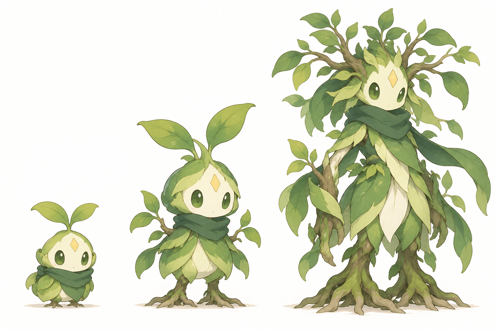

# 配图浏览 · 第 3 页

[返回首页](../README.md) · [试制清单](pilot.md)

共 100 个案例，每页最多 20 个。点击标题查看完整提示词、输入素材和对应结果。

[第 1 页](gallery.md) · [第 2 页](gallery-2.md) · 第 3 页 · [第 4 页](gallery-4.md) · [第 5 页](gallery-5.md)

## [SC-090 · 路线与游览地图](../prompts/education/SC-090/README.md)

## [SC-091 · 时间线知识卡](../prompts/education/SC-091/README.md)

## [SC-100 · 设备爆炸分解图](../prompts/charts-technical/SC-100/README.md)

## [SC-101 · 分层剖面结构图](../prompts/charts-technical/SC-101/README.md)

## [SC-102 · 给定数据柱形图](../prompts/charts-technical/SC-102/README.md)

## [SC-103 · 流程与决策图](../prompts/charts-technical/SC-103/README.md)

## [SC-104 · 关系网络示意](../prompts/charts-technical/SC-104/README.md)

## [SC-105 · 系统架构示意](../prompts/charts-technical/SC-105/README.md)

## [SC-112 · 透明水彩风景](../prompts/illustration/SC-112/README.md)

## [SC-113 · 厚涂油画静物](../prompts/illustration/SC-113/README.md)

## [SC-114 · 留白水墨山水](../prompts/illustration/SC-114/README.md)

## [SC-115 · 工笔动植物](../prompts/illustration/SC-115/README.md)

## [SC-116 · 木版限色风景](../prompts/illustration/SC-116/README.md)

## [SC-117 · 层叠剪纸场景](../prompts/illustration/SC-117/README.md)

## [SC-133 · 角色多视图设定](../prompts/characters/SC-133/README.md)

## [SC-134 · 角色表情与贴纸套组](../prompts/characters/SC-134/README.md)

## [SC-135 · 角色服装拆解页](../prompts/characters/SC-135/README.md)

## [SC-136 · 三维吉祥物设定](../prompts/characters/SC-136/README.md)

## [SC-137 · 动作姿态图集](../prompts/characters/SC-137/README.md)

## [SC-138 · 角色成长阶段设计](../prompts/characters/SC-138/README.md)

[第 1 页](gallery.md) · [第 2 页](gallery-2.md) · 第 3 页 · [第 4 页](gallery-4.md) · [第 5 页](gallery-5.md)
