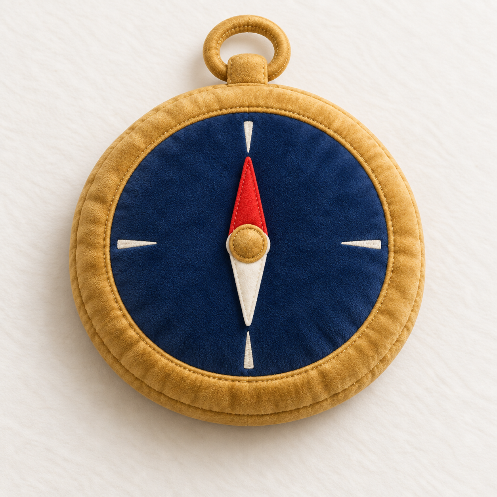
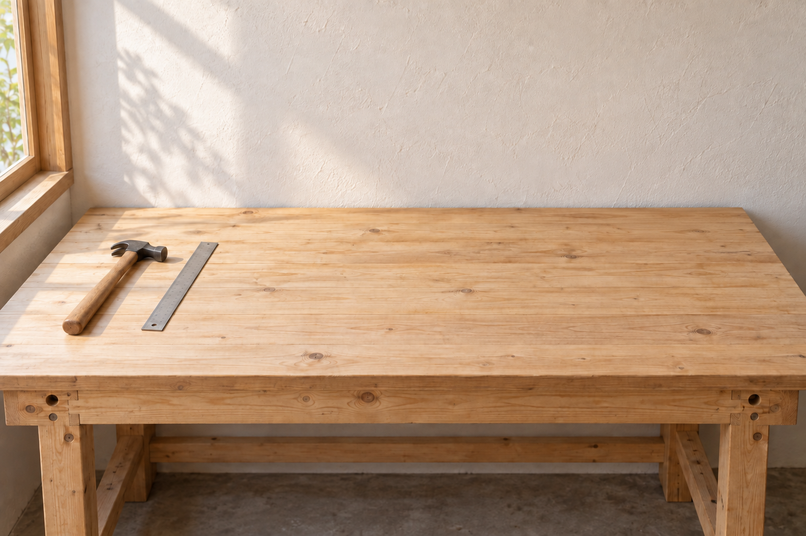
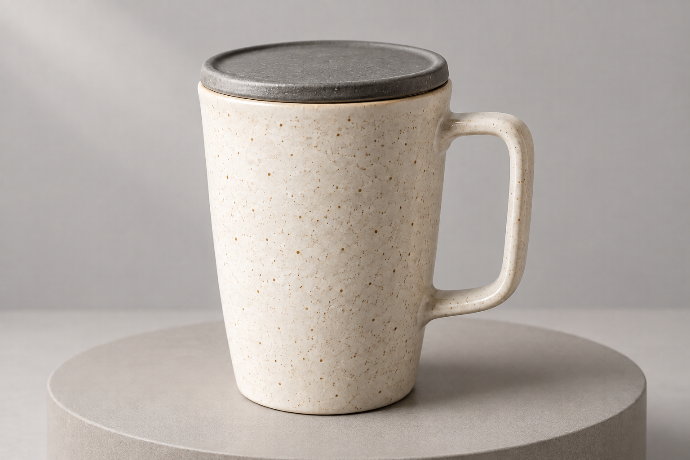

# 配图浏览 · 第 5 页

[返回首页](../README.md) · [试制清单](pilot.md)

共 100 个案例，每页最多 20 个。点击标题查看完整提示词、输入素材和对应结果。

[第 1 页](gallery.md) · [第 2 页](gallery-2.md) · [第 3 页](gallery-3.md) · [第 4 页](gallery-4.md) · 第 5 页

## [SC-193 · 原物玻璃化](../prompts/materials-surreal/SC-193/README.md)

## [SC-194 · 金属镀层重塑](../prompts/materials-surreal/SC-194/README.md)

## [SC-195 · 针织软雕塑](../prompts/materials-surreal/SC-195/README.md)

## [SC-196 · 毛绒物件转化](../prompts/materials-surreal/SC-196/README.md)

## [SC-197 · 充气物件转化](../prompts/materials-surreal/SC-197/README.md)

## [SC-210 · 移动应用首页](../prompts/interfaces/SC-210/README.md)

## [SC-211 · 桌面工作面板](../prompts/interfaces/SC-211/README.md)

## [SC-212 · 应用组件样式板](../prompts/interfaces/SC-212/README.md)

## [SC-213 · 草图转界面概念](../prompts/interfaces/SC-213/README.md)

## [SC-214 · 实体屏幕拍摄](../prompts/interfaces/SC-214/README.md)

## [SC-221 · 服装试穿合成](../prompts/fashion/SC-221/README.md)

## [SC-222 · 穿搭平铺与上身](../prompts/fashion/SC-222/README.md)

## [SC-223 · 多套服装造型页](../prompts/fashion/SC-223/README.md)

## [SC-224 · 服装材质细节](../prompts/fashion/SC-224/README.md)

## [SC-225 · 时装编辑场景](../prompts/fashion/SC-225/README.md)

## [SC-231 · 局部物体替换](../prompts/editing-restoration/SC-231/README.md)

## [SC-232 · 画面扩展构图](../prompts/editing-restoration/SC-232/README.md)

## [SC-233 · 局部背景清理](../prompts/editing-restoration/SC-233/README.md)

## [SC-234 · 背景替换合成](../prompts/editing-restoration/SC-234/README.md)

## [SC-235 · 黑白照片上色](../prompts/editing-restoration/SC-235/README.md)

[第 1 页](gallery.md) · [第 2 页](gallery-2.md) · [第 3 页](gallery-3.md) · [第 4 页](gallery-4.md) · 第 5 页
