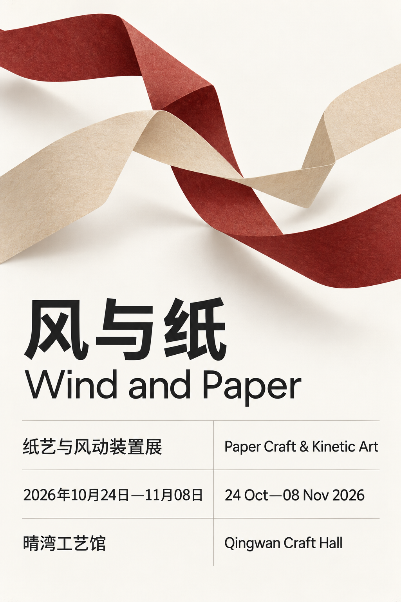

# 配图浏览

[返回首页](../README.md) · [试制清单](pilot.md)

共 20 个案例。点击标题查看完整提示词、输入素材和对应结果。

## [SC-001 · 侧窗光职业肖像](../prompts/portraits/SC-001/README.md)

## [SC-018 · 雨后街角纪实](../prompts/travel-nature/SC-018/README.md)

## [SC-030 · 棚拍商品主图](../prompts/products-food/SC-030/README.md)

## [SC-045 · 品牌视觉应用板](../prompts/branding-packaging/SC-045/README.md)

## [SC-058 · 中文活动海报](../prompts/posters-covers/SC-058/README.md)

## [SC-059 · 中英双语信息海报](../prompts/posters-covers/SC-059/README.md)

## [SC-075 · 短句人物卡片](../prompts/social-cards/SC-075/README.md)

## [SC-086 · 分步操作知识卡](../prompts/education/SC-086/README.md)

## [SC-100 · 设备爆炸分解图](../prompts/charts-technical/SC-100/README.md)

## [SC-112 · 透明水彩风景](../prompts/illustration/SC-112/README.md)

## [SC-133 · 角色多视图设定](../prompts/characters/SC-133/README.md)

## [SC-146 · 四格日常漫画](../prompts/comics-storyboards/SC-146/README.md)

## [SC-157 · 像素道具图集](../prompts/game-assets/SC-157/README.md)

## [SC-170 · 平面图转室内预览](../prompts/architecture/SC-170/README.md)

## [SC-182 · 等距微缩房间](../prompts/miniatures/SC-182/README.md)

## [SC-193 · 原物玻璃化](../prompts/materials-surreal/SC-193/README.md)

## [SC-210 · 移动应用首页](../prompts/interfaces/SC-210/README.md)

## [SC-221 · 服装试穿合成](../prompts/fashion/SC-221/README.md)

## [SC-231 · 局部物体替换](../prompts/editing-restoration/SC-231/README.md)

## [SC-232 · 画面扩展构图](../prompts/editing-restoration/SC-232/README.md)

