# 配图浏览 · 第 1 页

[返回首页](../README.md) · [试制清单](pilot.md)

共 100 个案例，每页最多 20 个。点击标题查看完整提示词、输入素材和对应结果。

第 1 页 · [第 2 页](gallery-2.md) · [第 3 页](gallery-3.md) · [第 4 页](gallery-4.md) · [第 5 页](gallery-5.md)

## [SC-001 · 侧窗光职业肖像](../prompts/portraits/SC-001/README.md)

## [SC-002 · 直闪日常抓拍](../prompts/portraits/SC-002/README.md)

<a href="../prompts/portraits/SC-002/README.md">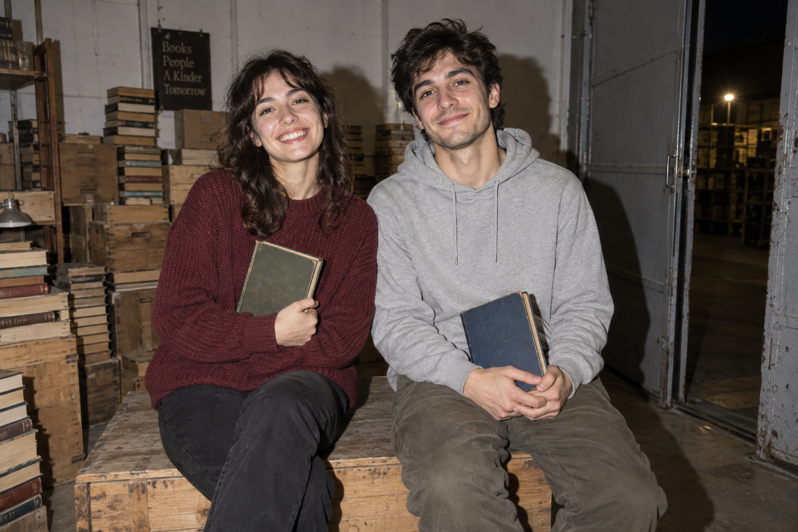</a>

## [SC-003 · 颗粒胶片情绪肖像](../prompts/portraits/SC-003/README.md)

## [SC-004 · 黑白硬光肖像](../prompts/portraits/SC-004/README.md)

## [SC-005 · 鱼眼近距合影](../prompts/portraits/SC-005/README.md)

<a href="../prompts/portraits/SC-005/README.md">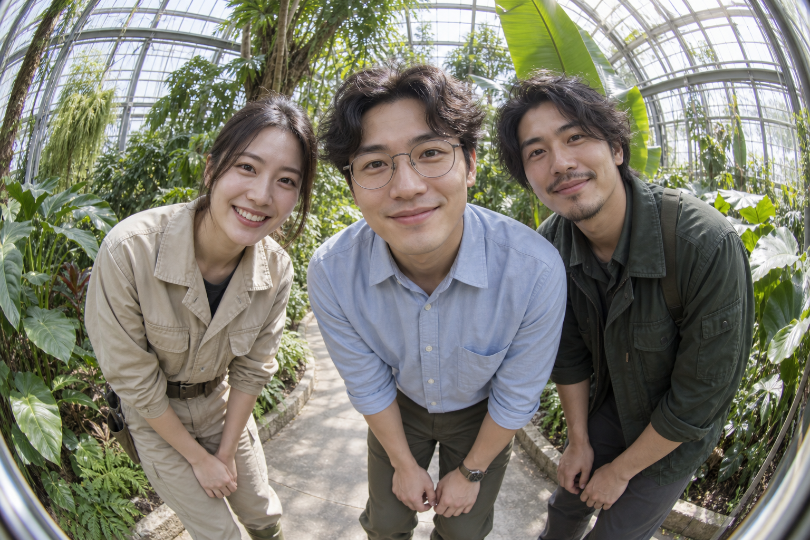</a>

## [SC-006 · 双重曝光肖像](../prompts/portraits/SC-006/README.md)

## [SC-018 · 雨后街角纪实](../prompts/travel-nature/SC-018/README.md)

## [SC-019 · 夜间长曝光街景](../prompts/travel-nature/SC-019/README.md)

## [SC-020 · 自然风景空气透视](../prompts/travel-nature/SC-020/README.md)

## [SC-021 · 水面镜像风景](../prompts/travel-nature/SC-021/README.md)

## [SC-022 · 动物自然瞬间](../prompts/travel-nature/SC-022/README.md)

<a href="../prompts/travel-nature/SC-022/README.md">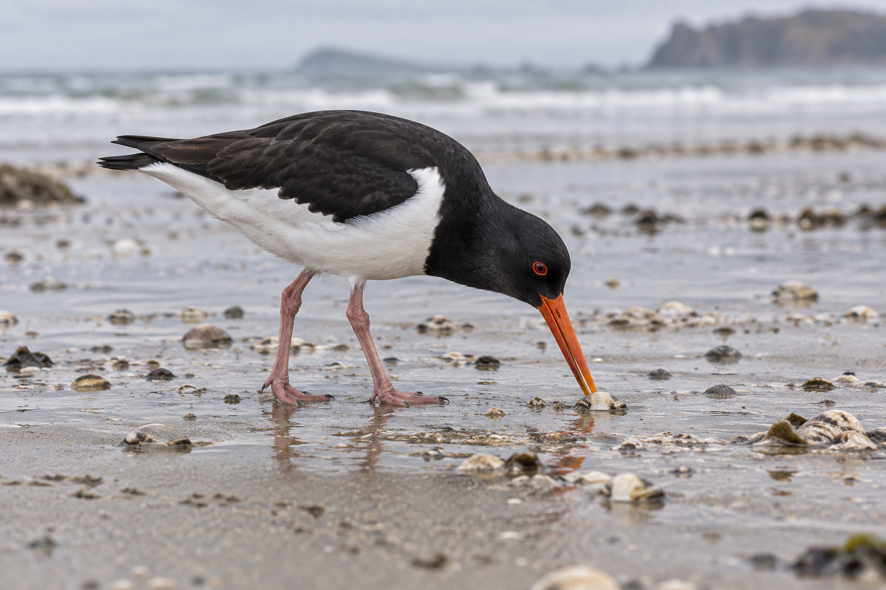</a>

## [SC-023 · 植物微距观察](../prompts/travel-nature/SC-023/README.md)

<a href="../prompts/travel-nature/SC-023/README.md">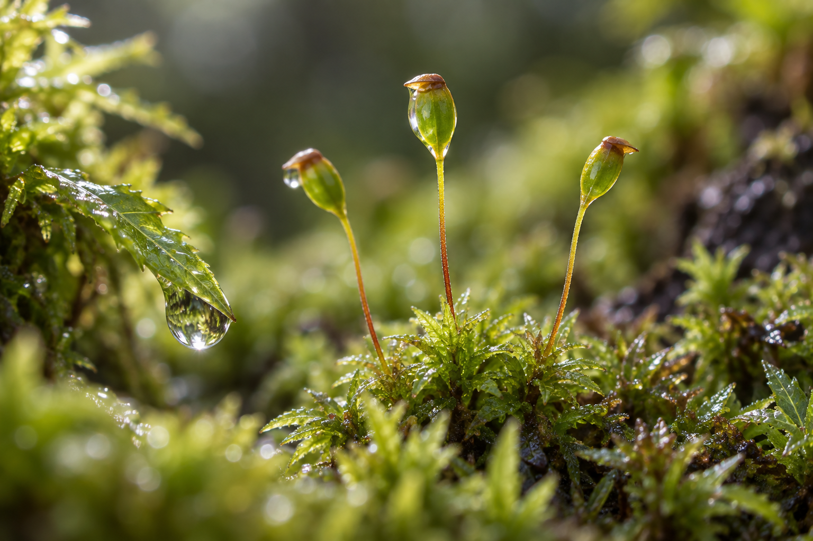</a>

## [SC-030 · 棚拍商品主图](../prompts/products-food/SC-030/README.md)

<a href="../prompts/products-food/SC-030/README.md">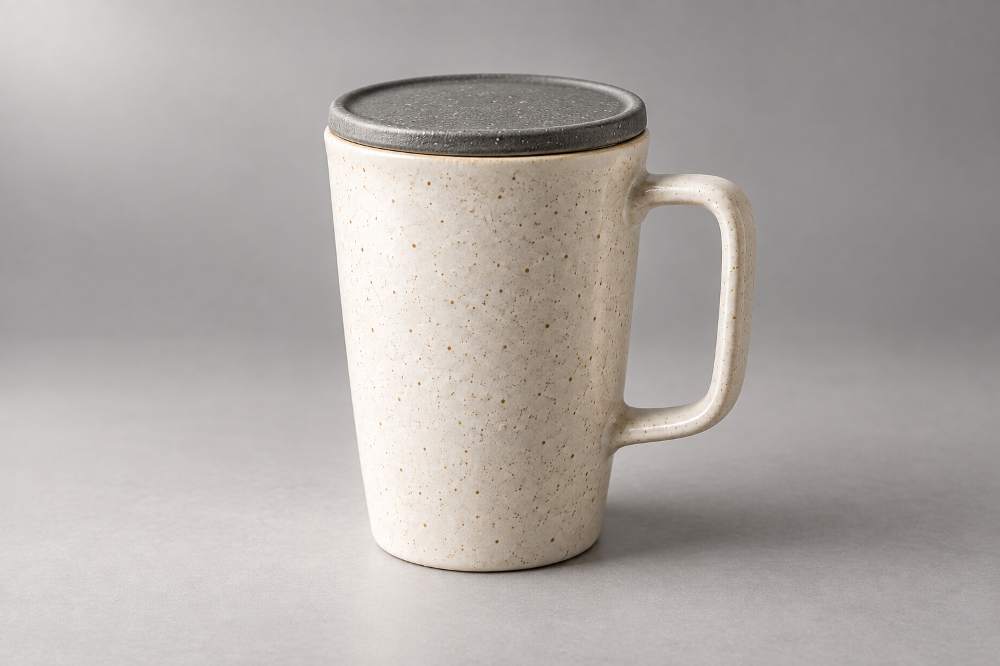</a>

## [SC-031 · 产品悬浮陈列](../prompts/products-food/SC-031/README.md)

<a href="../prompts/products-food/SC-031/README.md">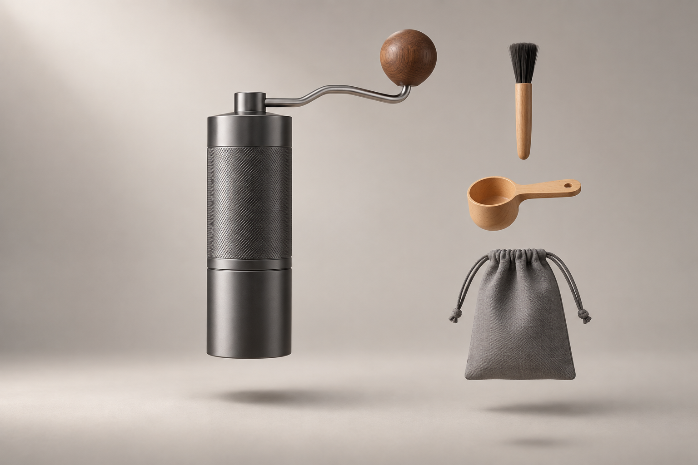</a>

## [SC-032 · 食材分层爆炸图](../prompts/products-food/SC-032/README.md)

<a href="../prompts/products-food/SC-032/README.md">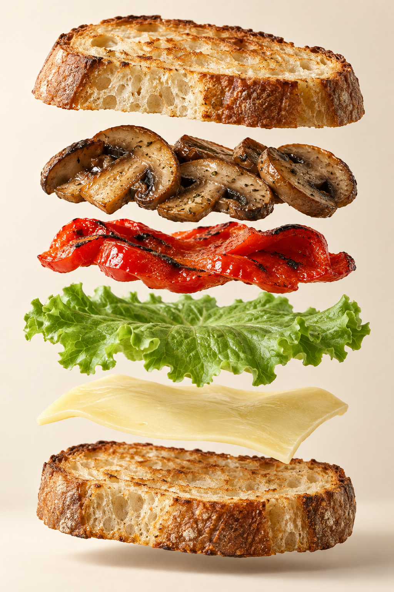</a>

## [SC-033 · 饮料飞溅广告](../prompts/products-food/SC-033/README.md)

<a href="../prompts/products-food/SC-033/README.md">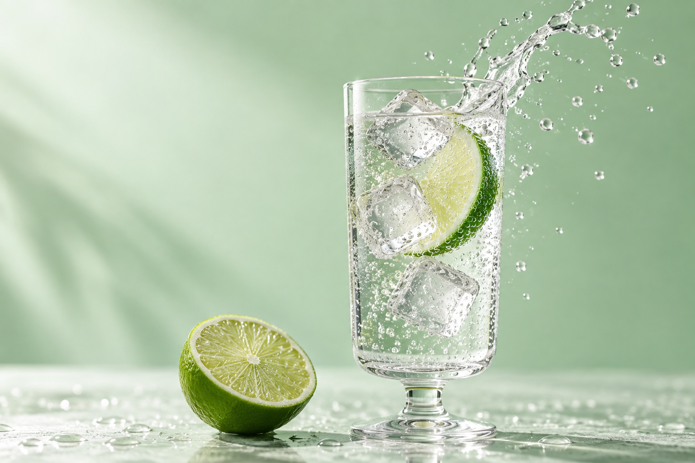</a>

## [SC-034 · 单品多色陈列](../prompts/products-food/SC-034/README.md)

<a href="../prompts/products-food/SC-034/README.md">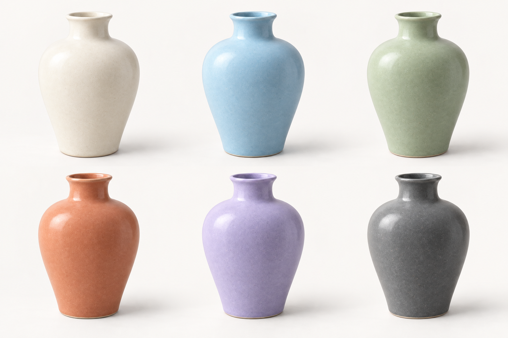</a>

## [SC-035 · 俯拍整齐排物](../prompts/products-food/SC-035/README.md)

<a href="../prompts/products-food/SC-035/README.md">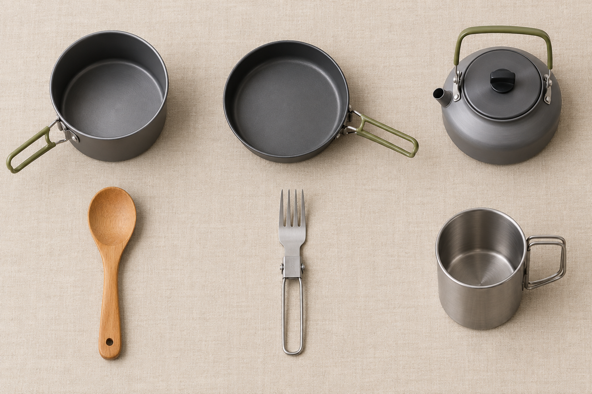</a>

## [SC-045 · 品牌视觉应用板](../prompts/branding-packaging/SC-045/README.md)

<a href="../prompts/branding-packaging/SC-045/README.md">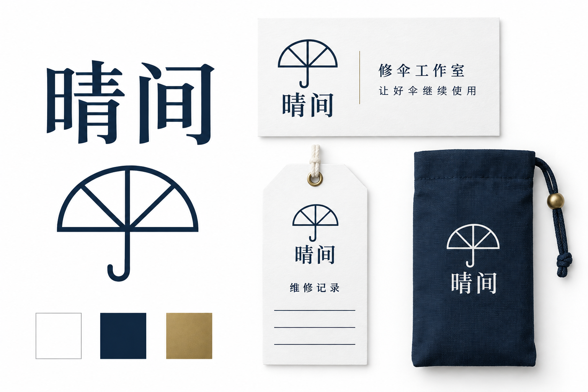</a>

## [SC-046 · 短字标识设计](../prompts/branding-packaging/SC-046/README.md)

第 1 页 · [第 2 页](gallery-2.md) · [第 3 页](gallery-3.md) · [第 4 页](gallery-4.md) · [第 5 页](gallery-5.md)
