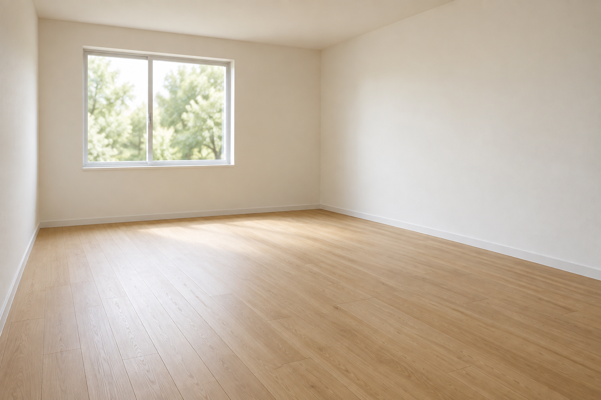

# 室内软装替换

[返回分类](../README.md)

状态：已配图。类型：编辑现有图片。风格：自然写实摄影。

将自建空房布置成阅读和植物角

核心机制：保留墙体与门窗并改变家具和软装

## 对应结果


## 输入图片

输入 1：待布置的原创空房照片



## 提示词

```text
编辑输入图 1 的原创空房照片，将其布置为阅读与植物角。保持横向构图、相机、全部墙角、原有左侧后墙窗户、窗框、木地板纹理和采光方向。右墙放一座低矮原木书架，架上少量无字书脊；后墙窗户右下放一把米色阅读椅，椅旁一张小圆边桌和一盆绿植，地上铺一块小型浅灰地毯。家具靠墙安放，中间留出通道，尺寸适合原房间，阴影随窗光落向右方。不得增加窗户、改变墙体或扩建空间。不加人物、文字、水印。
```

## 检查

墙体不移动；家具落地和比例合理

窗框、墙角、地板和相机视角延续输入，新增阅读椅、边桌、书架与绿植靠墙安置，中央通道保留。

[生成与检查记录](entry.json) · [提示词原文](prompt.md)

许可：[CC BY 4.0](../../../docs/licensing.md)。
