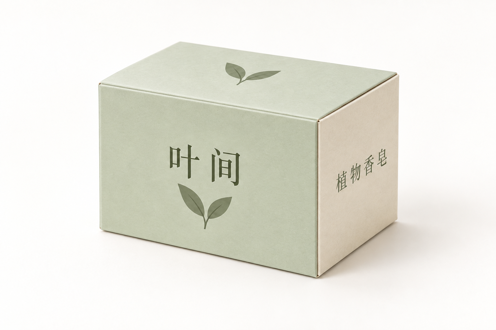
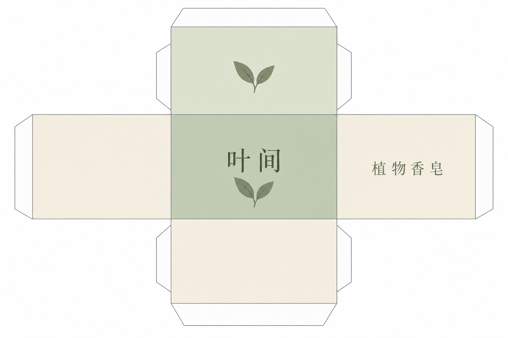

# 包装展开转立体

[返回分类](../README.md)

状态：已配图。类型：参考图引导生成。风格：商业棚拍。

自制香皂盒的包装概念展示

核心机制：按展开稿的面关系折合成立体包装

## 对应结果



## 输入图片

输入 1：原创香皂盒平面展开设计



## 提示词

```text
使用输入图 1 的原创香皂盒平面展开图，生成横幅 3:2 的立体包装概念棚拍。只呈现一个组装完成的长方体小盒，三分之四视角，同时看到正面、右侧面和顶面。正面按输入保留浅绿底、中文「叶间」与双叶图形；右侧面保留米色和「植物香皂」；顶面保留浅绿和双叶图形。不要把粘贴舌片留在盒外，也不重复正面到所有面。暖白无缝背景、均匀柔光、克制纸张纹理，盒边折叠可信。只展示概念外观，不增加尺寸、香皂实物、新文案、商标或水印。
```

## 检查

正侧顶面对应；明确仅为设计预览

输入的正面、右侧与顶面图案分别落在盒体对应面，「叶间」「植物香皂」可读。展开图及成品用于外观概念，不作为可制造刀模。

[生成与检查记录](entry.json) · [提示词原文](prompt.md)

许可：[CC BY 4.0](../../../docs/licensing.md)。
