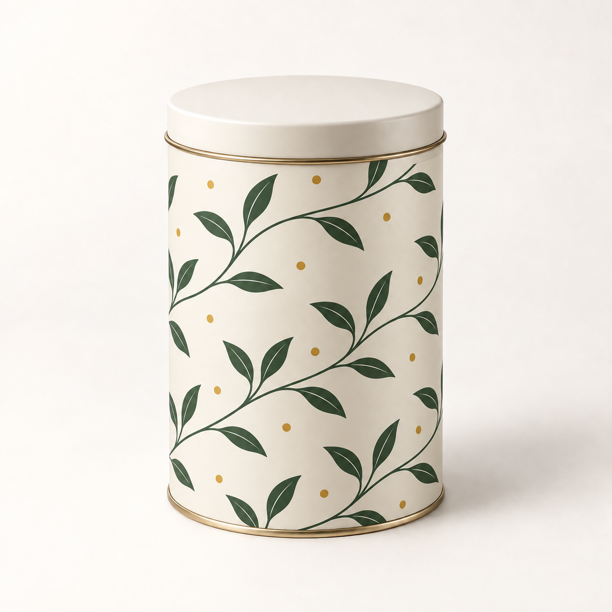
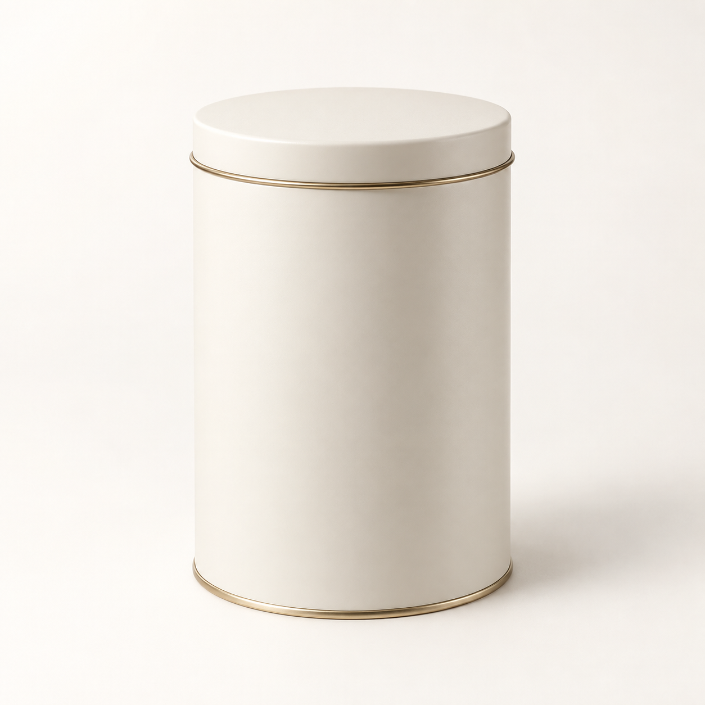
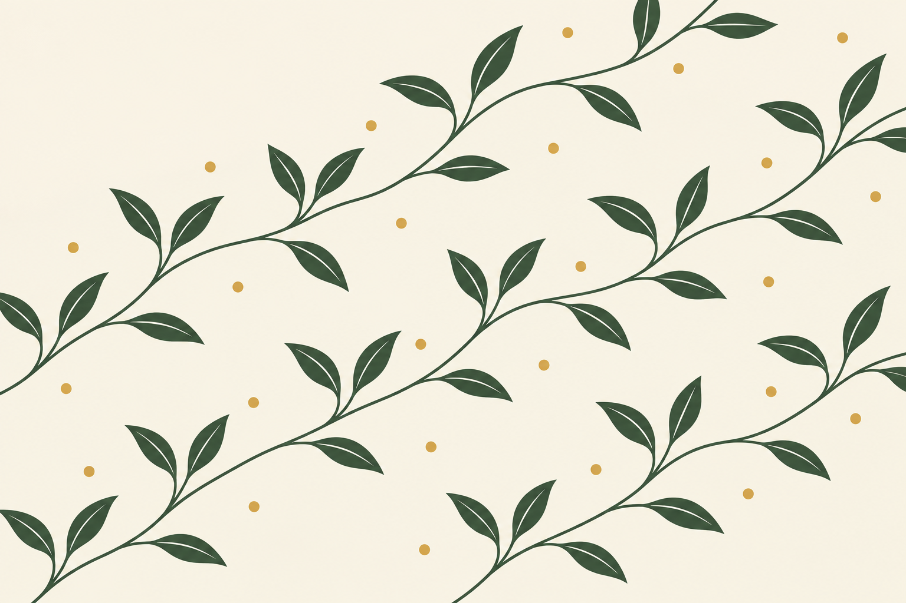

# 包装与物件图案贴合

[返回分类](../README.md)

状态：已配图。类型：编辑现有图片。风格：商业棚拍。

给自制圆筒茶罐贴上原创纹样

核心机制：平面设计沿目标曲面和接缝连续贴合

## 对应结果



## 输入图片

输入 1：待编辑的原创圆筒茶罐



输入 2：原创茶枝印花素材



## 提示词

```text
编辑输入图 1 的原创圆筒茶罐，把输入图 2 的原创茶枝纹样贴合到罐身侧壁。输入图 1 为唯一产品基底，输入图 2 只提供平面花纹。保持正方形画幅、罐身轮廓、盖子、金属包边、相机位置与背景光线。将浅米底、深绿双叶枝条与金色小点按自然比例环绕侧壁，纹样随圆柱曲率在两侧缩短，不越过盖子和底边，接缝位于背面。保留原有接触阴影和反射方向，不把图案当贴片悬浮在空中。不要文字、额外茶罐、包装或水印。
```

## 检查

图案不过界；接缝和曲率合理；保留原物形状

茶枝花纹沿罐身弯曲，盖子与金属包边保持素色，产品轮廓、背景和光线延续输入。

[生成与检查记录](entry.json) · [提示词原文](prompt.md)

许可：[CC BY 4.0](../../../docs/licensing.md)。
