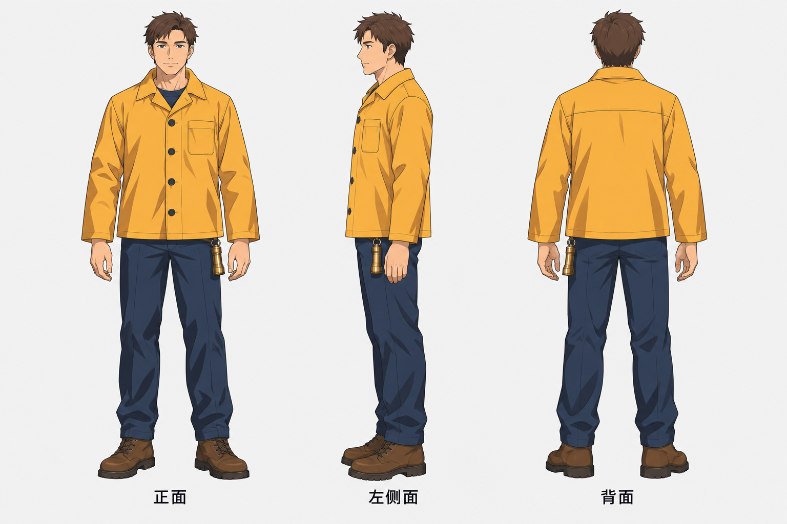

# 角色设定与表情

[返回首页](../../README.md) · [使用方法](../../docs/usage.md)

规划 13 个选题，图库案例 1 条。点击已制作的条目可查看完整提示词与图片。

| 编号 | 场景 | 类型 | 风格 | 状态 | 批次 |
|---|---|---|---|---|---|
| SC-133 | [角色多视图设定](SC-133/README.md) | 参考图引导生成 | 动漫赛璐璐 | 已配图 | 试制 |
| SC-134 | 角色表情与贴纸套组 | 参考图引导生成 | 动漫赛璐璐 | 规划中 | 首批补充 |
| SC-135 | 角色服装拆解页 | 直接生图 | 动漫赛璐璐 | 规划中 | 首批补充 |
| SC-136 | 三维吉祥物设定 | 直接生图 | 风格化三维 | 规划中 | 首批补充 |
| SC-137 | 动作姿态图集 | 参考图引导生成 | 动漫赛璐璐 | 规划中 | 首批补充 |
| SC-138 | 角色成长阶段设计 | 直接生图 | 动漫赛璐璐 | 规划中 | 首批补充 |
| SC-139 | 原创奇幻生物 | 直接生图 | 细节叙事插画 | 规划中 | 扩展 |
| SC-140 | 真人参考卡通化 | 参考图引导生成 | 风格化三维 | 规划中 | 扩展 |
| SC-141 | 角色群体关系设定 | 直接生图 | 动漫赛璐璐 | 规划中 | 扩展 |
| SC-142 | 角色与模型同框 | 参考图引导生成 | 商业棚拍 | 规划中 | 扩展 |
| SC-143 | 平面人设转实体摆件 | 参考图引导生成 | 商业棚拍 | 规划中 | 扩展 |
| SC-144 | 剪影角色辨识 | 直接生图 | 平面剪影 | 规划中 | 扩展 |
| SC-145 | 角色年龄阶段 | 参考图引导生成 | 自然写实摄影 | 规划中 | 扩展 |

## 配图预览

### 角色多视图设定

[查看提示词](SC-133/README.md)

