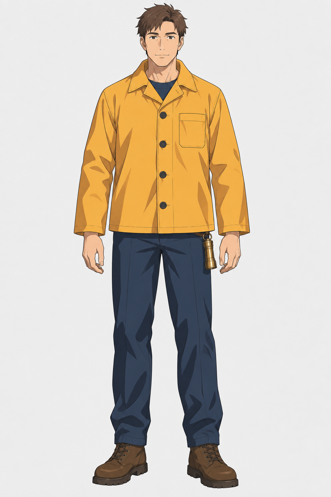

# 角色多视图设定

[返回分类](../README.md)

状态：已配图。类型：参考图引导生成。风格：动漫赛璐璐。

原创成年灯塔巡护员的角色设定

核心机制：固定角色在正侧背视图中保持结构一致

## 对应结果


## 输入图片

输入 1：原创成年灯塔巡护员，角色结构参考



## 提示词

```text
使用输入图 1 作为唯一角色参考，制作一张横幅 3:2 的原创成年灯塔巡护员三视图设定表，保持动漫赛璐璐风格。

在浅灰白背景上，从左到右等高排列正面、左侧面、背面三个完整全身视图。三个视图使用相同的站立姿势、头身比例、鞋底基线和头顶高度。角色是同一位成年巡护员，保留参考图中的短棕发、橙黄色短雨衣、深蓝长裤、棕色短靴、左胸长方形口袋与左腰的黄铜手电筒。衣服纽扣、口袋、袖口和鞋型跨视图一致。

参考图中被遮挡的背面采用简洁合理的延续：平整雨衣后背，一条水平肩部接缝，没有背包、兜帽、额外徽章或新配饰。左侧面视图中的人物面向画面左侧，显示角色身体的左侧及左腰手电。每个视图脚下依次只写「正面」「左侧面」「背面」。

线稿清楚，平涂色块与两级硬边阴影，不增加厚涂、写实皮肤、复杂环境、透视动作或额外角色。整张图恰好三个视图，三个中文标注逐字准确。
```

## 检查

衣饰和比例跨视图一致；视角标注正确

已检查正面、左侧面、背面的标注和阅读顺序。三个视图保持成年角色的发型、服装配色、四枚正面纽扣、左胸口袋与左腰手电，背面采用简洁肩部接缝，未增添背包或兜帽。

[生成与检查记录](entry.json) · [提示词原文](prompt.md)

许可：[CC BY 4.0](../../../docs/licensing.md)。
