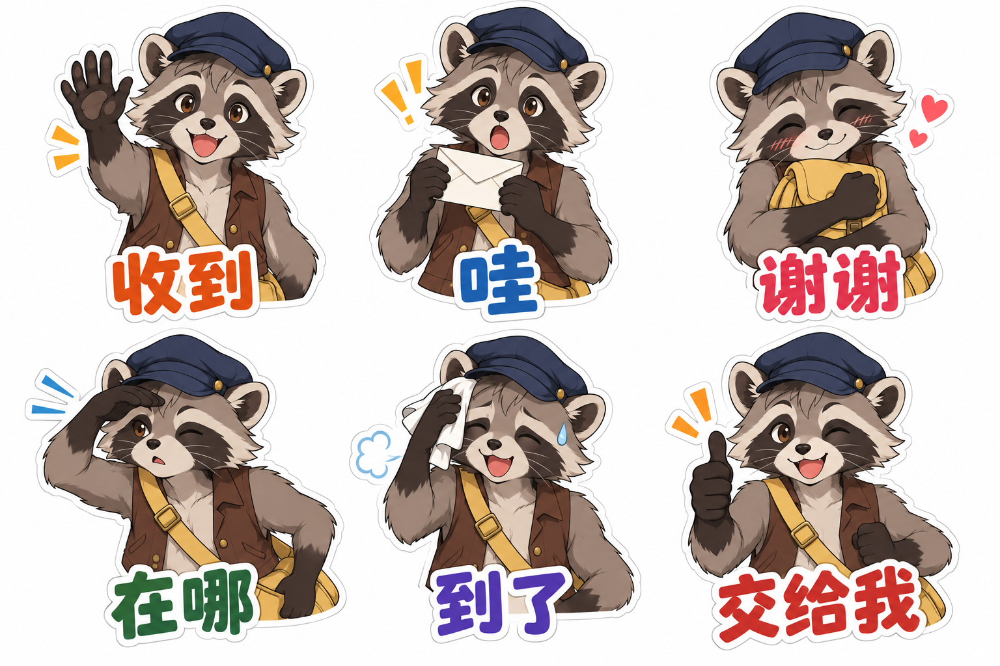

# 角色表情与贴纸套组

[返回分类](../README.md)

状态：已配图。类型：参考图引导生成。风格：动漫赛璐璐。

原创浣熊信使的六种表情贴纸与简短标签

核心机制：同一头部结构在多格内表达可区分的情绪

## 对应结果



## 输入图片

输入 1：原创浣熊信使角色参考


## 提示词

```text
使用输入图 1 的原创浣熊信使，制作横幅 3:2 的六枚表情贴纸总览，严格 3 列 2 行。保留灰褐毛色、黑色眼罩纹、蓝帽、棕马甲与黄色邮包，赛璐璐动画风格；每格画半身动作和清楚表情，白色描边、纯白背景。第一行依次为开心挥手「收到」、举信封惊讶「哇」、抱邮包害羞「谢谢」；第二行依次为抬手遮眼找路「在哪」、松口气擦汗「到了」、竖拇指「交给我」。六段文字各出现一次，放在各自贴纸下方，手势结构合理，角色大小和身份一致，不加额外贴纸或水印。
```

## 检查

表情与标签对应；身份不漂移；各格便于独立裁切

六枚表情与六句短语对应，浣熊的眼罩纹、帽子、马甲及邮包延续参考；半身贴纸的头顶留白较紧。

[生成与检查记录](entry.json) · [提示词原文](prompt.md)

许可：[CC BY 4.0](../../../docs/licensing.md)。
