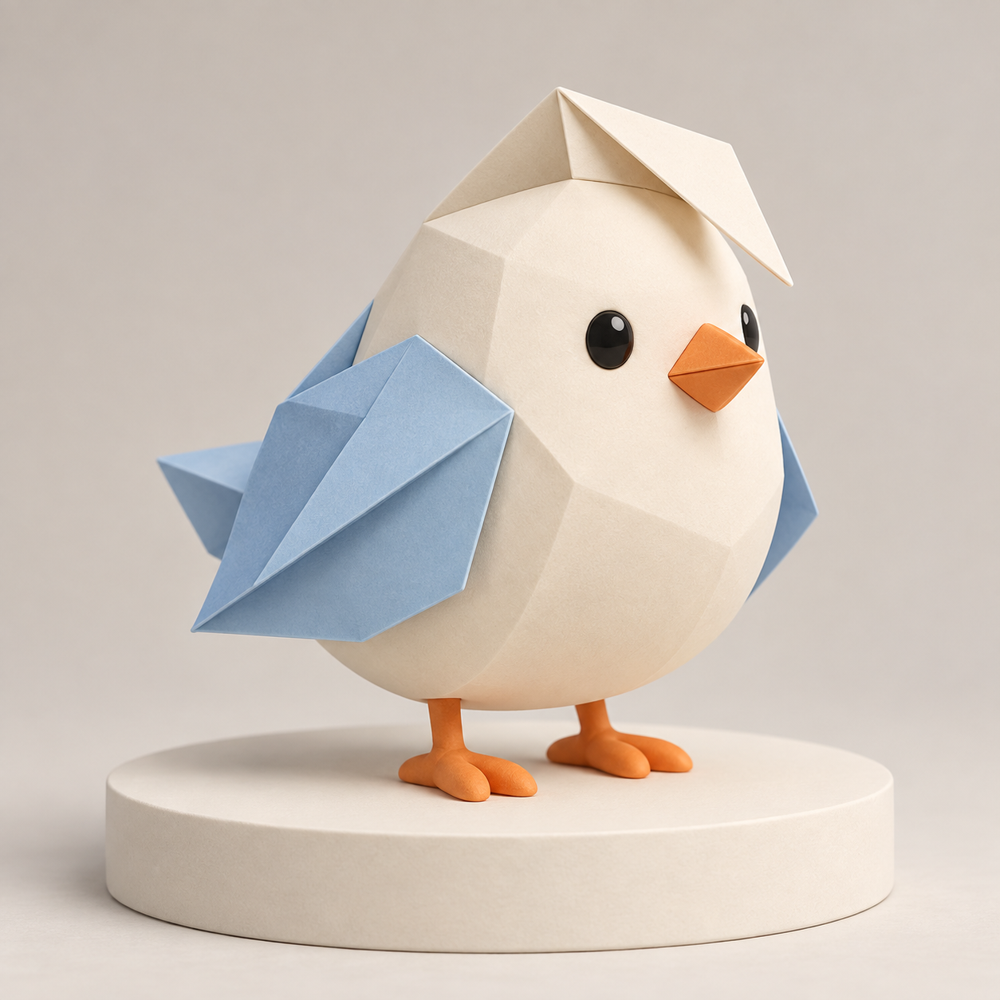

# 三维吉祥物设定

[返回分类](../README.md)

状态：已配图。类型：直接生图。风格：风格化三维。

虚构纸艺节的折角小鸟吉祥物

核心机制：统一比例、轮廓和材质建立角色识别

## 对应结果



## 提示词

```text
创作方形的原创纸艺节吉祥物概念图，风格化三维。一只由折角纸张启发的圆润小鸟站在米白展示台上，身体浅奶油色，翅膀是有清楚折线的浅蓝纸片形状，头顶有一个向前折下的三角纸角，短橙喙、两粒黑眼、两只橙色小脚。材质兼有哑光玩具表面与纸折轮廓，四分之三视角，柔和棚光，接触阴影清楚。造型简洁且便于从轮廓识别，只画一只完整鸟，不加文字、纸屑、品牌、现成卡通元素或水印。
```

## 检查

核心轮廓突出；材质与结构统一

单只折角小鸟的三角头角、浅蓝折纸翅与橙脚清楚，底座接触阴影合理。

[生成与检查记录](entry.json) · [提示词原文](prompt.md)

许可：[CC BY 4.0](../../../docs/licensing.md)。
