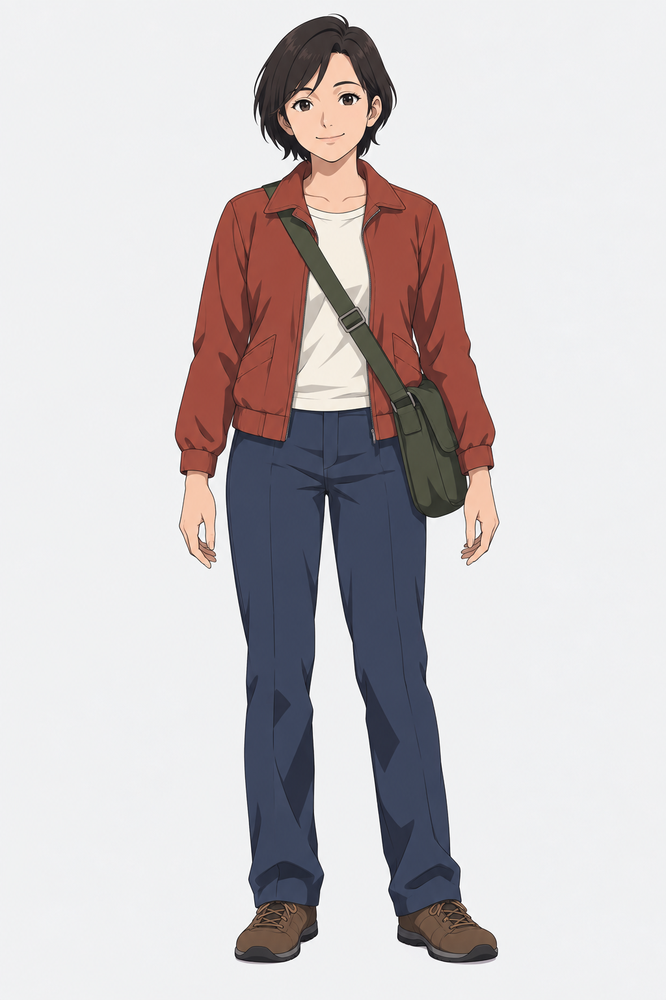

# 动作姿态图集

[返回分类](../README.md)

状态：已配图。类型：参考图引导生成。风格：动漫赛璐璐。

原创成年邮递员的六种投递动作

核心机制：同一角色在多种完整动作中保持服饰和比例

## 对应结果


## 输入图片

输入 1：原创成年邮递员角色参考



## 提示词

```text
使用输入图 1 作为唯一角色参考，绘制横幅 3:2 的六姿态成年邮递员动作表，3 列 2 行，赛璐璐动画风格，白底。保持同一短黑发成年女性、红夹克、米白上衣、藏蓝长裤、棕鞋与绿色邮包。六格依次为：站立读信、向前快走、弯腰捡信、伸手递信、抬手敲门、坐下休息。各格只出现同一人的一个完整身体，体型与服装不变，动作差异明显；敲门格只画一小段门框，其他背景留白。脚掌落点与四肢连接自然，不加编号、文字、额外角色或水印。
```

## 检查

动作互不重复；四肢数量及关节合理

六个动作依次为读信、快走、捡信、递信、敲门、休息，发型与衣服保持一致；休息格增加了台阶作为支撑。

[生成与检查记录](entry.json) · [提示词原文](prompt.md)

许可：[CC BY 4.0](../../../docs/licensing.md)。
