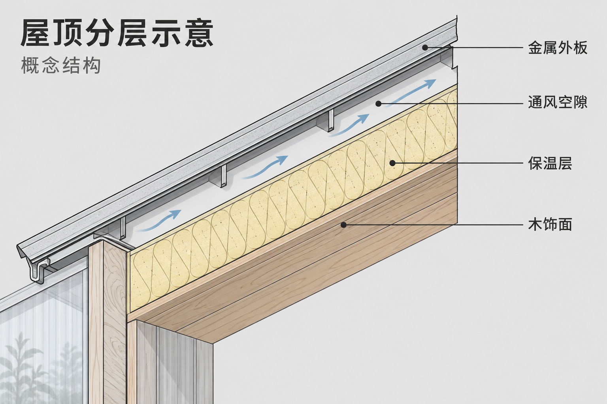

# 分层剖面结构图

[返回分类](../README.md)

状态：已配图。类型：直接生图。风格：技术线描。

虚构温室屋顶隔热结构的剖面

核心机制：外壳切开后展示内部层次关系

## 对应结果



## 提示词

```text
画横幅 3:2 的技术线描剖面说明图，主题是虚构温室附属工具间的隔热屋顶概念。标题「屋顶分层示意」，副标题「概念结构」。中央为向右上倾斜的屋顶局部断面，从外到内严格四层：外层薄金属板、中间连续通风空隙、浅黄色保温层、内层木饰面。右侧四条不交叉的引线分别指到各层并写「金属外板」「通风空隙」「保温层」「木饰面」。线描清晰，浅灰底，材料剖面使用不同稀疏纹理，层次连续且不互穿。不要施工尺寸、性能数据、认证标记或更多结构层。生成供交流的概念图，无水印。
```

## 检查

切面方向统一；层次不互相穿插

四层屋顶材料次序正确，引线落点清楚且不交叉，通风方向通过箭头表达。属于概念分层图。

[生成与检查记录](entry.json) · [提示词原文](prompt.md)

许可：[CC BY 4.0](../../../docs/licensing.md)。
