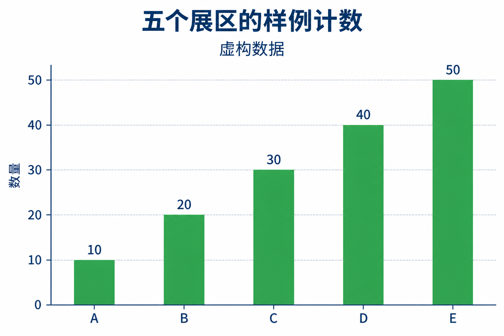

# 给定数据柱形图

[返回分类](../README.md)

状态：已配图。类型：直接生图。风格：科学示意。

给定五组虚构样本的回收数量

核心机制：柱高与数值严格对应

## 对应结果



## 提示词

```text
生成横幅 3:2 的简洁科学图表示意，白底、深蓝文字、绿色实心柱。标题「五个展区的样例计数」，副标题「虚构数据」。纵轴标题「数量」，刻度严格为 0、10、20、30、40、50，等距水平网格线六条。横轴从左到右为 A、B、C、D、E，五根等宽柱从共同的 0 基线起，高度严格为 10、20、30、40、50，顶端分别对齐对应网格线，柱顶直接写各自数值。无三维透视、断轴、图例或第二组数据。文字和数字清楚，布局留白，不额外生成数值或水印。
```

## 检查

柱高比例、刻度和标注逐项核对

五根柱分别对齐 10、20、30、40、50 刻度，共用零基线，标签与样例数据一致。

[生成与检查记录](entry.json) · [提示词原文](prompt.md)

许可：[CC BY 4.0](../../../docs/licensing.md)。
