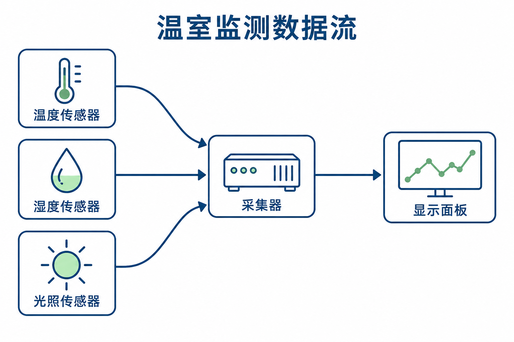

# 系统架构示意

[返回分类](../README.md)

状态：已配图。类型：直接生图。风格：技术线描。

虚构温室监测系统的数据流图

核心机制：分层组件与数据流构成完整链路

## 对应结果



## 提示词

```text
制作横幅 3:2 的技术线描系统数据流图，虚构温室监测概念。标题「温室监测数据流」。左侧竖排三个节点，上到下为「温度传感器」「湿度传感器」「光照传感器」，各配对应简图；中央一个节点「采集器」；右侧一个节点「显示面板」。三个传感器各以独立箭头指向采集器，采集器以一条箭头指向显示面板，严格五个节点、四条向右箭头。连接线不穿过节点，文字完整可读，白底深蓝技术线、少量浅绿填色。面板只画无字折线小图，不添加网络云、控制器、指标值或水印。
```

## 检查

输入输出匹配；箭头语义一致

三个传感器分别连向采集器，再连显示面板，五节点、四箭头与指定关系一致。

[生成与检查记录](entry.json) · [提示词原文](prompt.md)

许可：[CC BY 4.0](../../../docs/licensing.md)。
