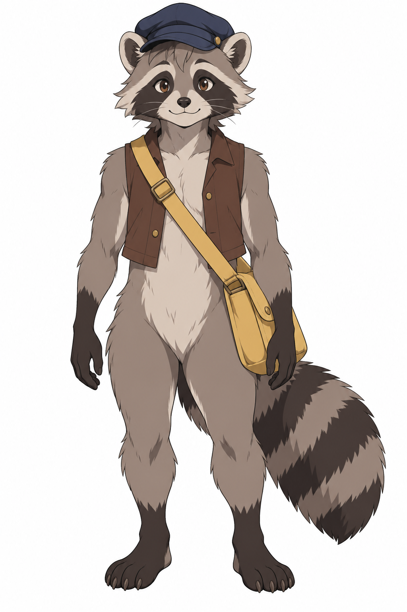

# 角色参考短篇漫画

[返回分类](../README.md)

状态：已配图。类型：参考图引导生成。风格：动漫赛璐璐。

两位原创信使交换误送包裹的短篇

核心机制：多名已知角色在连续分格中保持身份

## 对应结果


## 输入图片

输入 1：原创浣熊信使角色参考



输入 2：原创成年邮递员角色参考


## 提示词

```text
使用输入图 1 的原创浣熊信使和输入图 2 的原创成年女邮递员，绘制横幅 3:2 的三格赛璐璐漫画，横向等宽排列。保持浣熊蓝帽棕马甲黄邮包，女邮递员短黑发红夹克绿邮包。第一格两人在邮局木柜台两侧各拿一个包裹，浣熊拿蓝包裹，女人拿红包裹，女人气泡说「这件好像是你的。」；第二格两人把包裹在柜台上互换，无对白；第三格浣熊抱红包裹、女人抱蓝包裹，浣熊气泡说「现在对啦！」。气泡尾巴明确指向说话者，包裹不凭空消失，每格仅这两位角色。无额外文字、水印。
```

## 检查

每格身份稳定；气泡指向正确

三格中浣熊邮差与红衣收件人的外观连续，包裹由拿错到交换再到确认的顺序清楚，两句对白正确；交换时包裹悬在柜台上方，未完全按提示落在台面。

[生成与检查记录](entry.json) · [提示词原文](prompt.md)

许可：[CC BY 4.0](../../../docs/licensing.md)。
