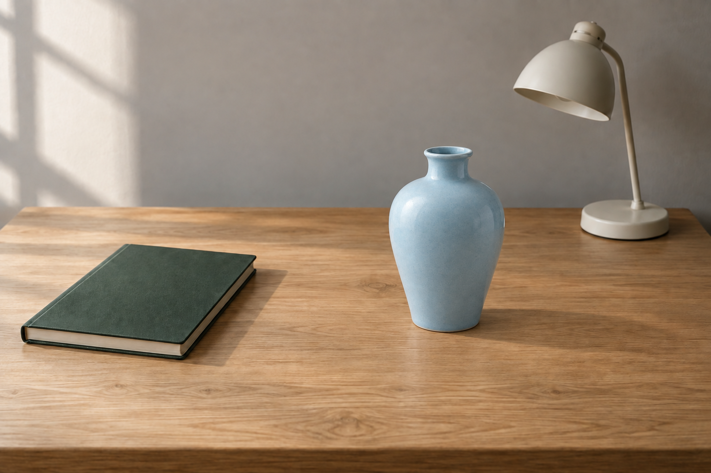
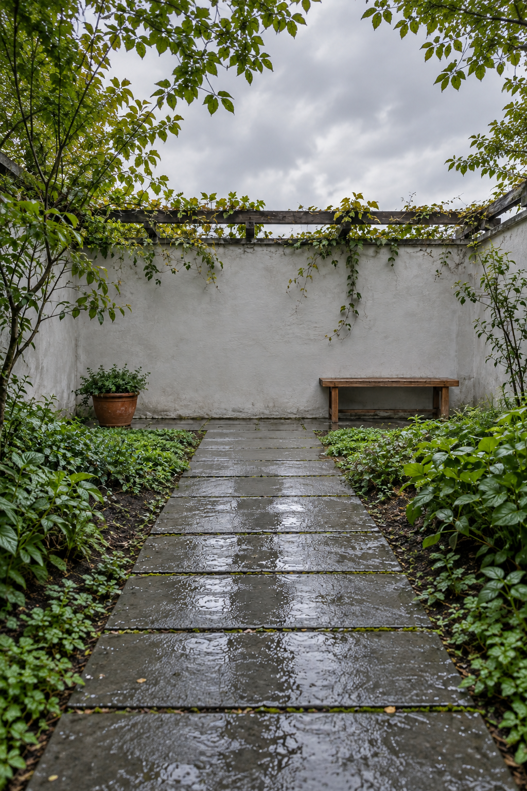

# 图像编辑与修复

[返回首页](../../README.md) · [使用方法](../../docs/usage.md)

规划 17 个选题，图库案例 2 条。点击已制作的条目可查看完整提示词与图片。

| 编号 | 场景 | 类型 | 风格 | 状态 | 批次 |
|---|---|---|---|---|---|
| SC-231 | [局部物体替换](SC-231/README.md) | 编辑现有图片 | 保持输入风格 | 已配图 | 试制 |
| SC-232 | [画面扩展构图](SC-232/README.md) | 编辑现有图片 | 保持输入风格 | 已配图 | 试制 |
| SC-233 | 局部背景清理 | 编辑现有图片 | 保持输入风格 | 规划中 | 首批补充 |
| SC-234 | 背景替换合成 | 编辑现有图片 | 保持输入风格 | 规划中 | 首批补充 |
| SC-235 | 黑白照片上色 | 编辑现有图片 | 自然写实摄影 | 规划中 | 首批补充 |
| SC-236 | 破损照片修补 | 编辑现有图片 | 保持输入风格 | 规划中 | 扩展 |
| SC-237 | 低清图像整理 | 编辑现有图片 | 保持输入风格 | 规划中 | 扩展 |
| SC-238 | 局部色彩修改 | 编辑现有图片 | 保持输入风格 | 规划中 | 扩展 |
| SC-239 | 昼夜光照编辑 | 编辑现有图片 | 保持输入风格 | 规划中 | 扩展 |
| SC-240 | 画内文字替换 | 编辑现有图片 | 保持输入风格 | 规划中 | 扩展 |
| SC-241 | 画内文字翻译 | 编辑现有图片 | 保持输入风格 | 规划中 | 扩展 |
| SC-242 | 线稿按色卡上色 | 编辑现有图片 | 保持输入风格 | 规划中 | 扩展 |
| SC-243 | 草图局部细化 | 编辑现有图片 | 保持输入风格 | 规划中 | 扩展 |
| SC-244 | 多素材场景合成 | 编辑现有图片 | 自然写实摄影 | 规划中 | 扩展 |
| SC-245 | 标注引导局部修改 | 编辑现有图片 | 保持输入风格 | 规划中 | 扩展 |
| SC-246 | 保留身份调整视线 | 编辑现有图片 | 保持输入风格 | 规划中 | 扩展 |
| SC-247 | 原图提取线描 | 编辑现有图片 | 手绘线稿 | 规划中 | 扩展 |

## 配图预览

### 局部物体替换

[查看提示词](SC-231/README.md)

### 画面扩展构图

[查看提示词](SC-232/README.md)

