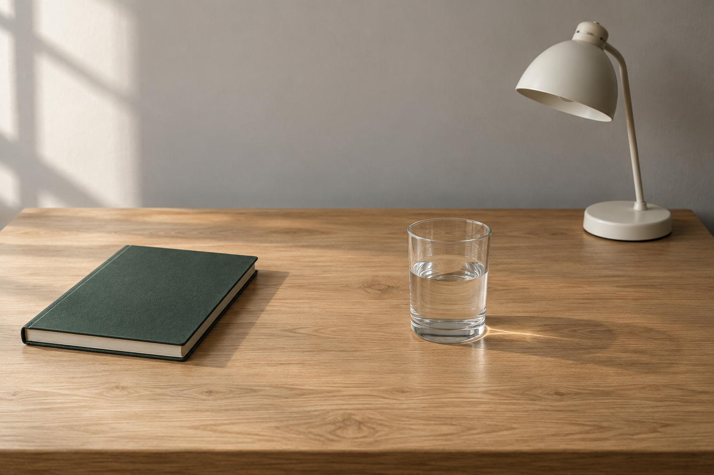
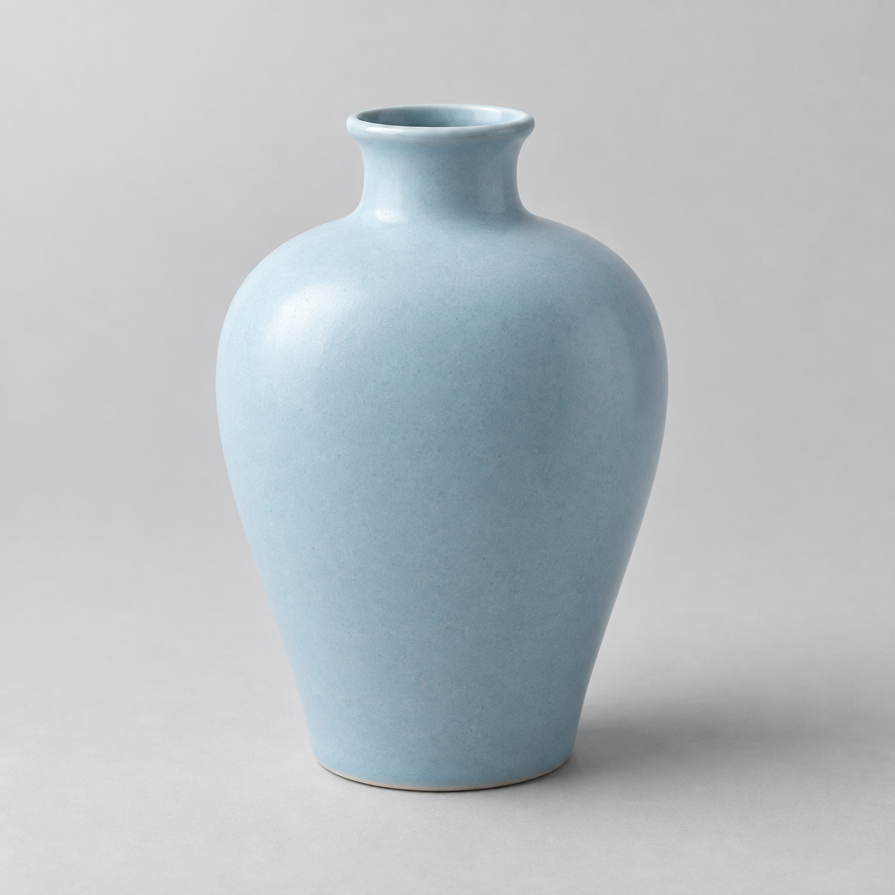

# 局部物体替换

[返回分类](../README.md)

状态：已配图。类型：编辑现有图片。风格：保持输入风格。

在自建桌面照片中以原创花瓶替换水杯

核心机制：指定物体替换后保持其余画面

## 对应结果


## 输入图片

输入 1：待编辑的原创桌面照片



输入 2：原创陶瓷花瓶，替换物体参考



## 提示词

```text
编辑输入图 1 的桌面照片：仅把画面中央偏右的透明水杯替换为输入图 2 中的原创浅蓝色陶瓷花瓶。输入图 1 是待编辑基底，输入图 2 只提供花瓶外形、釉色与纹理。保持输入图 1 的横幅 3:2 画幅。

移除原水杯以及水杯产生的反光和阴影，在相同桌面位置放置花瓶。保留花瓶的细窄瓶口、短颈、圆肩与略收窄的平底，不插入鲜花、枝叶或其他物体。花瓶高度约为原水杯的一点五倍，完整入画，位置不遮挡左侧合拢的笔记本或右后方的小台灯。

匹配基底照片的拍摄视角、左侧自然窗光、景深与色温，陶瓷高光柔和，底部接触阴影方向和硬度与原场景一致。

编辑范围限制为原水杯及其阴影区域、花瓶新增占据区域和必要的接触阴影。保持其余桌面木纹、笔记本、台灯、后墙、构图和背景细节。不要重排物体、裁切、添加文字、花卉、装饰品或水印。
```

## 检查

修改区域之外保持；接触阴影与光向一致

已对照基底照片与花瓶素材。花瓶位于原水杯区域，高度约为原杯的 1.5 倍，形状和浅蓝釉色保留；笔记本、台灯、墙面光影与桌面构图保持。修改范围按视觉对照检查，不表示逐像素完全相同。

[生成与检查记录](entry.json) · [提示词原文](prompt.md)

许可：[CC BY 4.0](../../../docs/licensing.md)。
