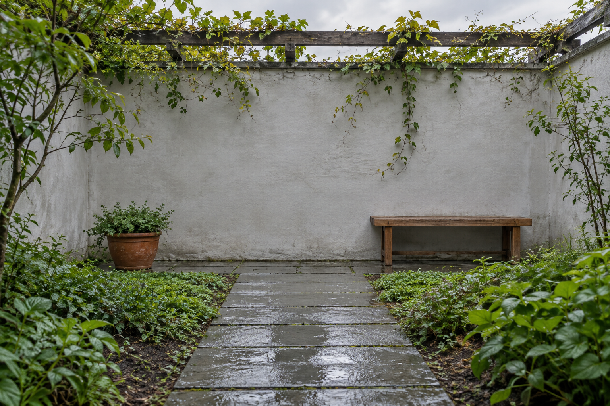

# 画面扩展构图

[返回分类](../README.md)

状态：已配图。类型：编辑现有图片。风格：保持输入风格。

把自建横向庭院图扩展为竖向画面

核心机制：从已有边界延续场景并调整可用构图

## 对应结果


## 输入图片

输入 1：待扩展的原创庭院照片



## 提示词

```text
扩展输入图 1 的横向庭院照片，输出竖幅 2:3 的完整画面。原图为横幅 3:2，只向上方与下方延展场景，不裁切原图左右边缘，不拉伸原图。

将原始画面完整保留在新画布的中部，保留原图中的石板小径、后方浅灰院墙、左侧陶盆、右侧木凳与攀藤架的相对位置、轮廓和透视。新增上方区域自然延续攀藤架、藤叶与柔和阴天天空；新增下方区域延续石板路的透视、地面纹理和少量边缘苔藓。

画面继续保持雨后安静庭院的自然写实摄影风格，光照方向、曝光、色温、湿润石板和景深与原图一致。新旧边界要平滑衔接，石板缝、院墙线和植物枝条连续，不产生重复拷贝痕迹。

只补充原画面外的环境，不重新绘制已有主体，不增加人物、动物、家具、门窗、文字或水印。原图左右两边均完整保留在最终画面中。
```

## 检查

原画面结构保留；边缘衔接自然

已对照横向原图检查左侧陶盆、右侧木凳、院墙和攀藤架的相对位置，原构图在竖幅中部保留。上方新增天空与藤叶，下方延续湿石板路；未新增家具或人物，边界没有明显接缝。检查为视觉对照，未声称原区域逐像素不变。

[生成与检查记录](entry.json) · [提示词原文](prompt.md)

许可：[CC BY 4.0](../../../docs/licensing.md)。
