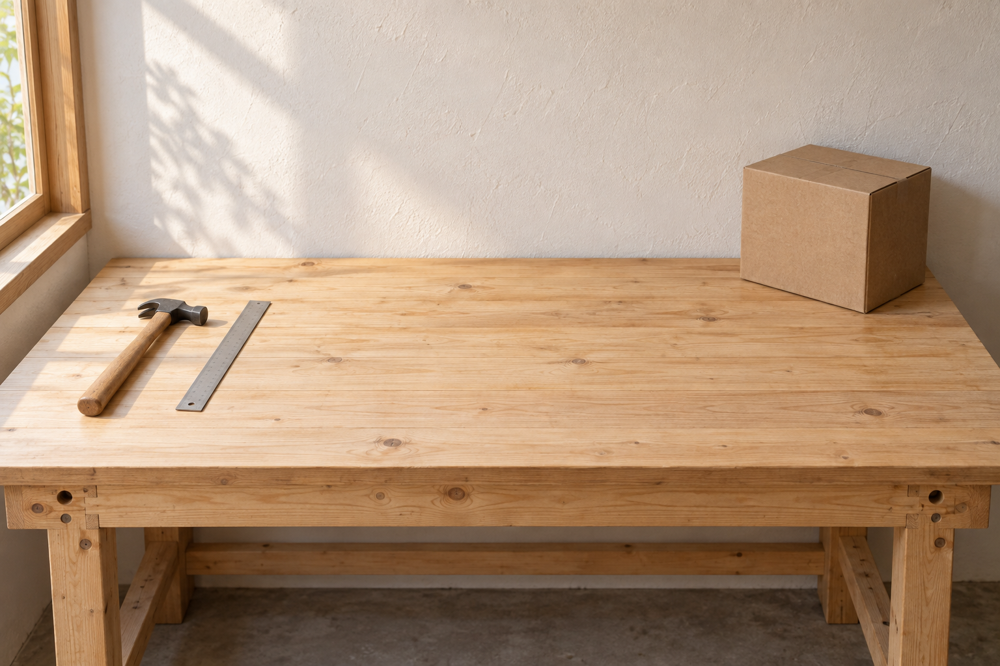

# 局部背景清理

[返回分类](../README.md)

状态：已配图。类型：编辑现有图片。风格：保持输入风格。

清理自建工作台照片角落的纸箱

核心机制：移除指定背景杂物并补足遮挡区域

## 对应结果


## 输入图片

输入 1：待清理的原创工作台照片



## 提示词

```text
编辑输入图 1 的原创工作台照片，只移除右后方的棕色纸箱及其投在桌面和墙上的阴影。根据周围连续木纹、白墙和已有柔光补全被纸箱挡住的区域。保留横向构图、相机、桌沿、墙面、左侧木锤与金属尺的形状位置、光线和颜色。处理后的右后桌面自然空出，木纹方向一致，不出现涂抹斑块、重复工具或新物件。不添加文字、水印，不更改左侧工具。
```

## 检查

仅处理指定区域；纹理连续

右后纸箱及其阴影已移除，补全桌面木纹和墙面连续；左侧木柄金属锤、尺、窗户与桌沿的位置保留。

[生成与检查记录](entry.json) · [提示词原文](prompt.md)

许可：[CC BY 4.0](../../../docs/licensing.md)。
