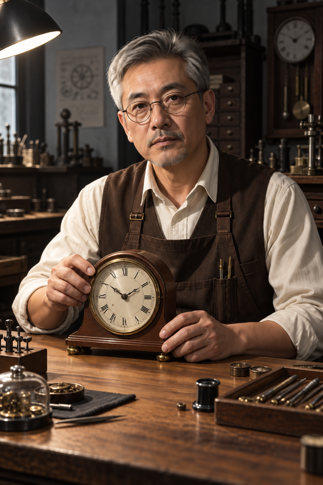

# 黑白照片上色

[返回分类](../README.md)

状态：已配图。类型：编辑现有图片。风格：自然写实摄影。

给自建黑白成年人物照片做色彩演示

核心机制：保留明暗与身份并补充合理色彩

## 对应结果



## 输入图片

输入 1：待上色的原创黑白人物照片


## 提示词

```text
为输入图 1 的原创黑白钟表修理师照片进行自然上色。保持原有竖幅、成年人物脸部五官、灰色头发、圆框眼镜、姿势、手持钟表、桌面工具、背景和所有明暗关系。赋予自然肤色、米白衬衫、深棕工作围挡、木桌暖褐色、钟表金属灰铜色，背景保持低饱和暗灰。保留硬侧光与真实肤质，阴影仍有细节，不把黑白高反差改成平光。颜色是创作性推定，不声称还原真实历史颜色。不要添加或移除物品、年轻化、磨皮、文字或水印。
```

## 检查

明暗结构稳定；颜色是创作推测

上色后人物身份、姿势、钟表及工具位置保持，米白衣料、棕色工作围挡与暖木桌对应要求；面部暗部略提亮，主要侧光关系仍在，颜色为创作性推定。

[生成与检查记录](entry.json) · [提示词原文](prompt.md)

许可：[CC BY 4.0](../../../docs/licensing.md)。
