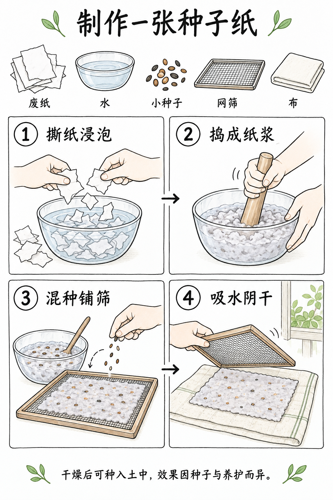

# 知识卡与教学图解

[返回首页](../../README.md) · [使用方法](../../docs/usage.md)

规划 14 个选题，图库案例 1 条。点击已制作的条目可查看完整提示词与图片。

| 编号 | 场景 | 类型 | 风格 | 状态 | 批次 |
|---|---|---|---|---|---|
| SC-086 | [分步操作知识卡](SC-086/README.md) | 直接生图 | 手绘线稿 | 已配图 | 试制 |
| SC-087 | 物件词汇卡 | 直接生图 | 扁平矢量插画 | 规划中 | 首批补充 |
| SC-088 | 自然观察图鉴 | 直接生图 | 水彩 | 规划中 | 首批补充 |
| SC-089 | 学习笔记可视化 | 直接生图 | 手绘线稿 | 规划中 | 首批补充 |
| SC-090 | 路线与游览地图 | 直接生图 | 细节叙事插画 | 规划中 | 首批补充 |
| SC-091 | 时间线知识卡 | 直接生图 | 复古印刷 | 规划中 | 首批补充 |
| SC-092 | 树状分类教学图 | 直接生图 | 科学示意 | 规划中 | 扩展 |
| SC-093 | 几何关系教学图 | 直接生图 | 技术线描 | 规划中 | 扩展 |
| SC-094 | 黑板课堂图解 | 直接生图 | 粉笔画 | 规划中 | 扩展 |
| SC-095 | 图像标注教学页 | 参考图引导生成 | 科学示意 | 规划中 | 扩展 |
| SC-096 | 折页使用说明 | 直接生图 | 技术线描 | 规划中 | 扩展 |
| SC-097 | 填色练习页 | 直接生图 | 手绘线稿 | 规划中 | 扩展 |
| SC-098 | 视觉字母联想 | 直接生图 | 扁平矢量插画 | 规划中 | 扩展 |
| SC-099 | 主题学习小报 | 直接生图 | 彩铅 | 规划中 | 扩展 |

## 配图预览

### 分步操作知识卡

[查看提示词](SC-086/README.md)

