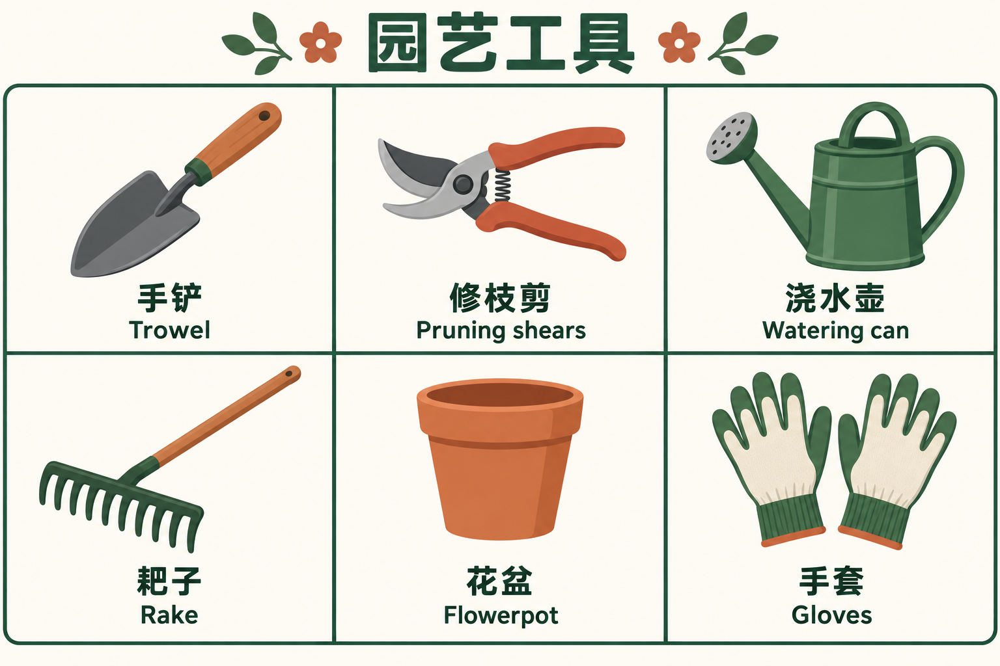

# 物件词汇卡

[返回分类](../README.md)

状态：已配图。类型：直接生图。风格：扁平矢量插画。

六种常见园艺工具的词汇卡

核心机制：一物一词与少量结构标注辅助认知

## 对应结果



## 提示词

```text
制作横幅 3:2 的园艺工具中英词汇卡，扁平矢量插画，暖白底、深绿字、陶土色点缀。标题「园艺工具」。下方严格 3 列 2 行，每格只画一件工具并在正下方写对应名称。第一行从左到右：「手铲 / Trowel」配短柄铲、「修枝剪 / Pruning shears」配单把修枝剪、「浇水壶 / Watering can」配带喷头的壶；第二行：「耙子 / Rake」配齿耙、「花盆 / Flowerpot」配空花盆、「手套 / Gloves」配一双手套。文字逐字准确，图文一一对应，工具互不遮挡，线条粗细一致。不要说明段落、品牌或水印。
```

## 检查

词与物一致；图标数量准确

六组园艺物件与中英文名称一一对应，手套为一双，三列两行排版和字形清楚。

[生成与检查记录](entry.json) · [提示词原文](prompt.md)

许可：[CC BY 4.0](../../../docs/licensing.md)。
