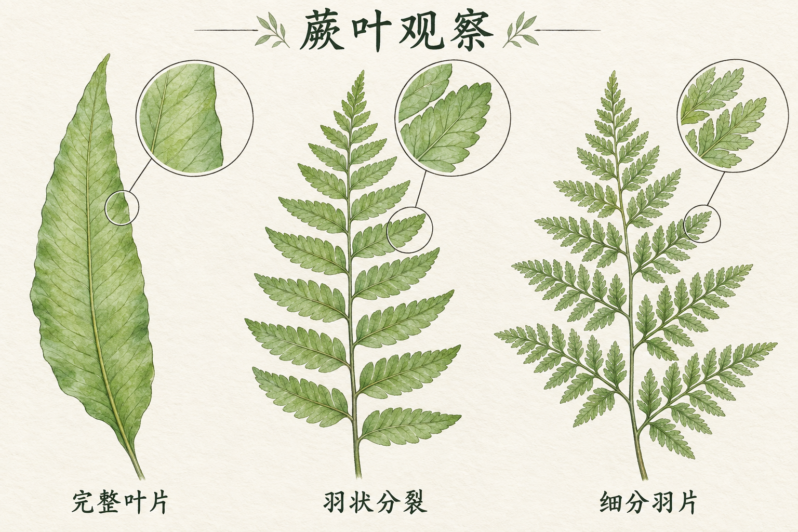

# 自然观察图鉴

[返回分类](../README.md)

状态：已配图。类型：直接生图。风格：水彩。

虚构教学页中的常见蕨类形态比较

核心机制：主体、局部细节与标注构成图鉴层级

## 对应结果



## 提示词

```text
画一张横幅 3:2 的水彩蕨叶观察图鉴，暖白纸纹、透明绿色水彩和细铅笔轮廓。标题「蕨叶观察」。三列由左到右各画一枚完整叶片，依次体现不分裂的完整叶片、沿叶轴分成一层小叶的羽状叶片、再次细分的细羽状叶片；每列下方只写「完整叶片」「羽状分裂」「细分羽片」。每列右上角放一个圆形局部放大框，用细线连接本列叶片的对应区域，放大框的叶缘和叶脉必须与被放大处一致。表现形态比较，不指定物种，不画花朵、果实、虚构药效或生长阶段箭头。叶片不相互重叠，文字清楚，无水印。
```

## 检查

知识在制作时核实；局部对应主体

三种叶片分裂形态有区别，放大框对应各自主叶区域，文字正确。仅作形态观察示意，不作物种鉴定。

[生成与检查记录](entry.json) · [提示词原文](prompt.md)

许可：[CC BY 4.0](../../../docs/licensing.md)。
