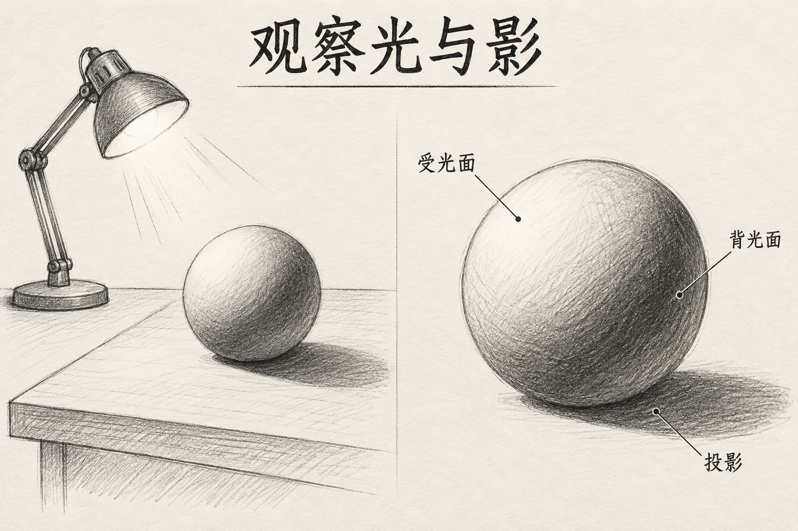

# 学习笔记可视化

[返回分类](../README.md)

状态：已配图。类型：直接生图。风格：手绘线稿。

给定的基础光影绘画笔记摘要

核心机制：章节标题和图示把短文组织成笔记页

## 对应结果



## 提示词

```text
把以下给定绘画练习笔记转换为横幅 3:2 的手绘线稿学习页：一盏灯在球体左上方；球体左上受光，右下转暗；桌面投影向右下延伸。标题只写「观察光与影」。左侧画灯、球体和桌面关系总图，右侧画同一球体明暗细节，最多三条细引线分别标注「受光面」「背光面」「投影」，引线终点准确落在对应区域。黑色铅笔线、少量灰色排线、米白纸底，草稿感但信息清楚。保留球体轮廓，投影接触球体底部。不要额外光源、矛盾阴影、知识段落或水印。
```

## 检查

仅使用提供的信息；阅读顺序清晰

左上光源、球体受光与背光区域、右下投影相互一致，三条引线指向相应区域。

[生成与检查记录](entry.json) · [提示词原文](prompt.md)

许可：[CC BY 4.0](../../../docs/licensing.md)。
