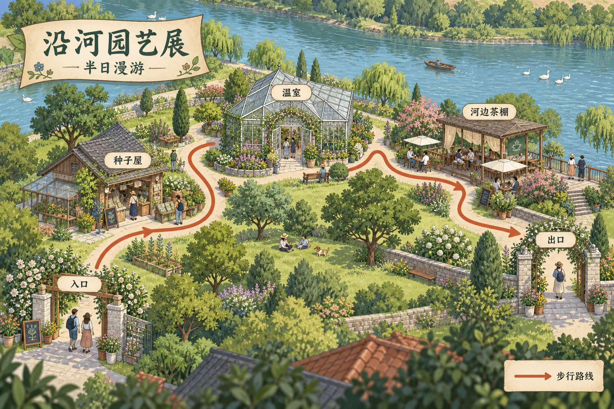

# 路线与游览地图

[返回分类](../README.md)

状态：已配图。类型：直接生图。风格：细节叙事插画。

虚构滨河园艺展的半日游览地图

核心机制：路线、地标与图例形成连续导览

## 对应结果



## 提示词

```text
绘制横幅 3:2 的细节叙事插画游览地图，场景为虚构河畔园艺展。标题「沿河园艺展」，副标题「半日漫游」。从左下入口到右下出口，单条清楚的赭色步行路线依次连接五站：「入口」「种子屋」「温室」「河边茶棚」「出口」，每站名称只标一次。河流沿画面上缘弯曲，五站均在同一岸，路径避开建筑和水面；少量花圃、树木与原创游客形成生活细节。右下独立小图例只写「步行路线」，配同色线。鸟瞰插画、暖绿与浅蓝、明确前后层次，不添加真实地址、比例尺、额外站点或水印。
```

## 检查

路线连通；站点顺序和图例一致

五站名称、顺序和图例可读，各站位于同一河岸。路线在温室附近有局部遮挡，浏览时仍可循左右段辨认方向。

[生成与检查记录](entry.json) · [提示词原文](prompt.md)

许可：[CC BY 4.0](../../../docs/licensing.md)。
