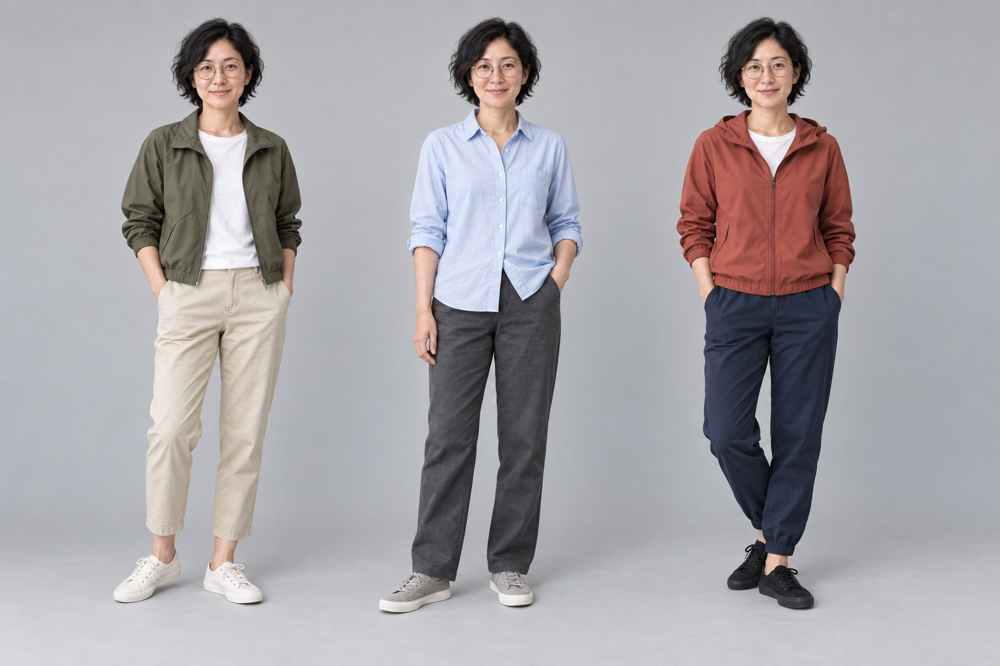
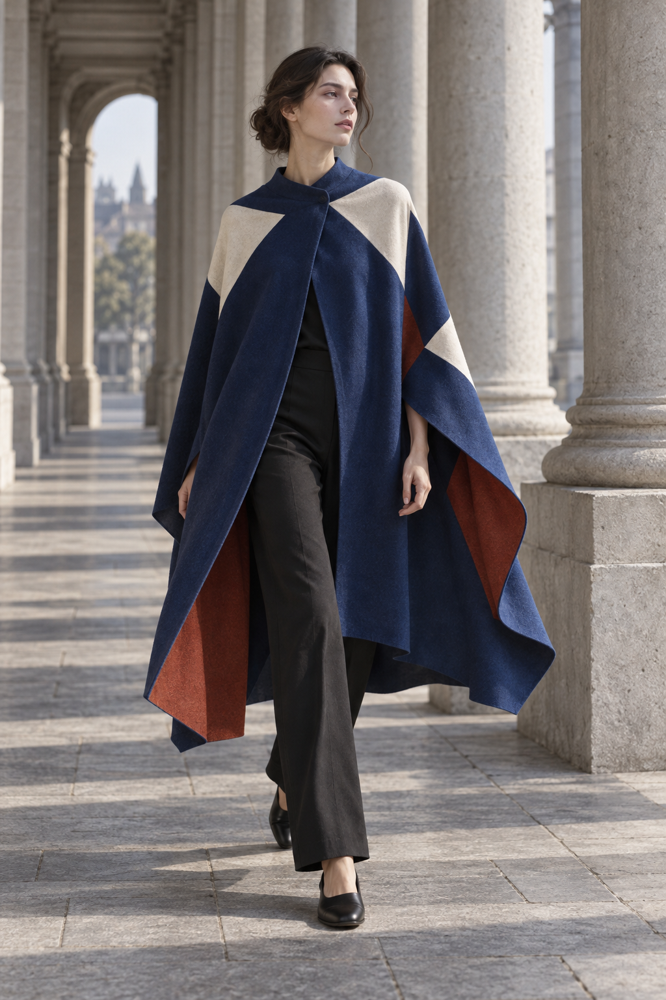

# 服饰造型与穿搭

[返回首页](../../README.md) · [使用方法](../../docs/usage.md)

规划 10 个选题，图库案例 5 条。点击已制作的条目可查看完整提示词与图片。

| 编号 | 场景 | 类型 | 风格 | 状态 | 批次 |
|---|---|---|---|---|---|
| SC-221 | [服装试穿合成](SC-221/README.md) | 编辑现有图片 | 时装编辑摄影 | 已配图 | 试制 |
| SC-222 | [穿搭平铺与上身](SC-222/README.md) | 参考图引导生成 | 时装编辑摄影 | 已配图 | 首批补充 |
| SC-223 | [多套服装造型页](SC-223/README.md) | 参考图引导生成 | 时装编辑摄影 | 已配图 | 首批补充 |
| SC-224 | [服装材质细节](SC-224/README.md) | 直接生图 | 时装编辑摄影 | 已配图 | 首批补充 |
| SC-225 | [时装编辑场景](SC-225/README.md) | 直接生图 | 时装编辑摄影 | 已配图 | 首批补充 |
| SC-226 | 发型可视化对照 | 编辑现有图片 | 自然写实摄影 | 规划中 | 扩展 |
| SC-227 | 妆面色彩可视化 | 编辑现有图片 | 自然写实摄影 | 规划中 | 扩展 |
| SC-228 | 服装设计稿预览 | 参考图引导生成 | 时装编辑摄影 | 规划中 | 扩展 |
| SC-229 | 纹身图案设计页 | 直接生图 | 手绘线稿 | 规划中 | 扩展 |
| SC-230 | 配饰珠宝造型 | 直接生图 | 商业棚拍 | 规划中 | 扩展 |

## 配图预览

### 服装试穿合成

[查看提示词](SC-221/README.md)

### 穿搭平铺与上身

[查看提示词](SC-222/README.md)

### 多套服装造型页

[查看提示词](SC-223/README.md)

### 服装材质细节

[查看提示词](SC-224/README.md)

### 时装编辑场景

[查看提示词](SC-225/README.md)

