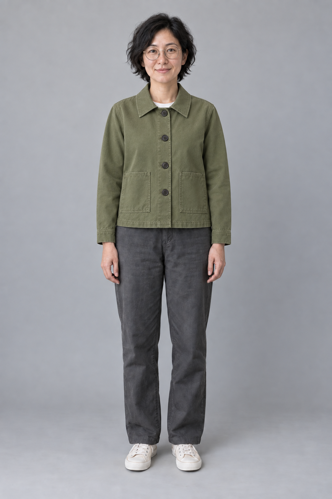
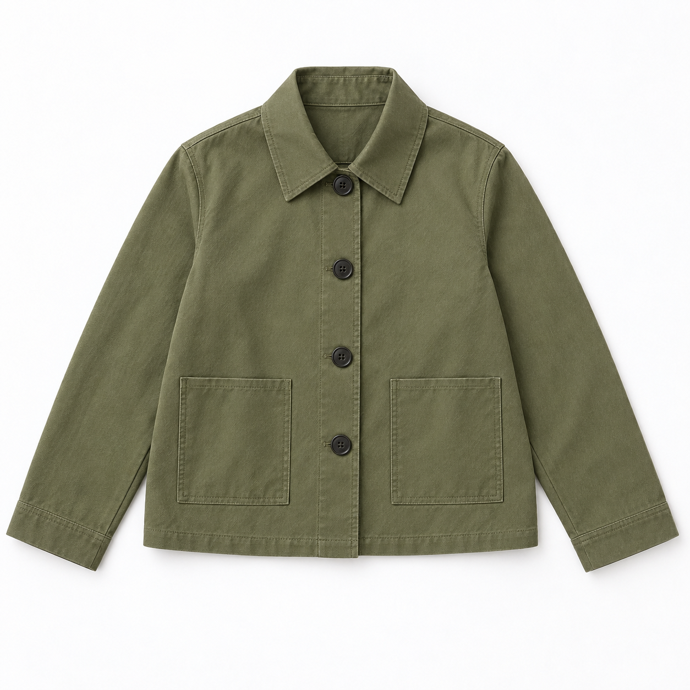

# 服装试穿合成

[返回分类](../README.md)

状态：已配图。类型：编辑现有图片。风格：时装编辑摄影。

自建成年模特试穿原创短款风衣

核心机制：保持人物身份与姿态并贴合目标服装

## 对应结果



## 输入图片

输入 1：待编辑的原创成年人物照片


输入 2：原创短款风衣，服装款式与细节参考



## 提示词

```text
编辑输入图 1，为其中的成年人物穿上输入图 2 展示的原创短款风衣。输入图 1 是唯一的人物与场景基底，输入图 2 只提供衣服的款式、颜色和细节。保持输入图 1 的竖幅 2:3 画幅。

保留人物脸型、五官、短卷黑发、细圆框眼镜、雀斑、表情、身材比例和站姿。头部、双手、双脚位置不变，保留原有深灰长裤、米白鞋子、浅灰摄影背景与光线。只在原白色上衣外穿上输入图 2 的苔绿色短款风衣，白色圆领可在领口少量露出。

风衣保持参考图中的尖翻领、单排四枚深色纽扣、左右对称的两个矩形贴袋、直筒长袖与齐髋下摆。不增加腰带、肩章、文字或额外口袋。衣服自然贴合人物肩部、胸部与手臂，袖口停在手腕处，领口、纽扣与门襟关系清楚，布料褶皱随站姿形成。

保持真实的时装摄影质感，皮肤与衣料光向一致，手指完整，衣服不吞没双手。不要美化或替换面部，不改变年龄、发型、身体轮廓、背景或相机位置。
```

## 检查

领口、袖长与身体对应；面部不变

已对照人物输入与服装输入，检查脸部、眼镜、发型、站姿、长裤和鞋子。风衣保留四枚纽扣、两个贴袋和尖翻领，袖口位于手腕，双手完整可见。检查依据为可见身份特征与衣服结构。

[生成与检查记录](entry.json) · [提示词原文](prompt.md)

许可：[CC BY 4.0](../../../docs/licensing.md)。
