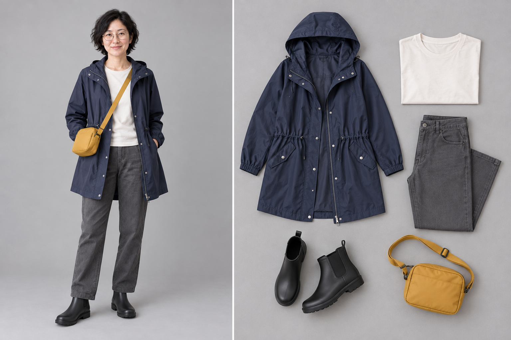
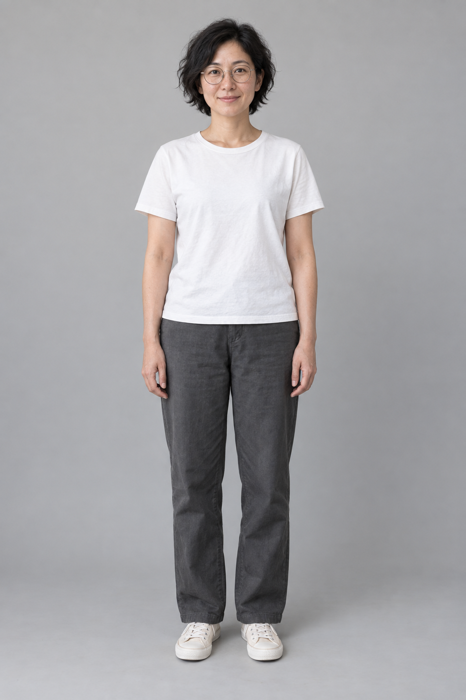

# 穿搭平铺与上身

[返回分类](../README.md)

状态：已配图。类型：参考图引导生成。风格：时装编辑摄影。

原创成年旅人的雨季通勤穿搭页

核心机制：人物着装和分离单品形成对应关系

## 对应结果



## 输入图片

输入 1：原创虚构成年人物身份参考



## 提示词

```text
使用输入图 1 的原创成年女性作为唯一身份参考，制作横幅 3:2 的雨天通勤穿搭对照，时装编辑摄影。左半区人物全身站立，保留短卷发、眼镜和面部特征，穿深蓝轻薄雨衣、米白圆领上衣、灰色直筒长裤、黑色短雨靴，肩挎一个芥末黄小斜挎包。右半区俯视平铺同一套五件服饰：雨衣、上衣、长裤、一双雨靴、小包，颜色、裁剪、口袋与扣件逐一对应。两区留白分明，暖灰背景、自然柔光，不加伞、帽子、文字、品牌或水印。
```

## 检查

上下衣及配件对应；不增加未穿物品

人物短卷发、眼镜与面部特征延续输入，右侧五类服饰与上身造型的颜色和款式对应，雨靴按一双展示。

[生成与检查记录](entry.json) · [提示词原文](prompt.md)

许可：[CC BY 4.0](../../../docs/licensing.md)。
