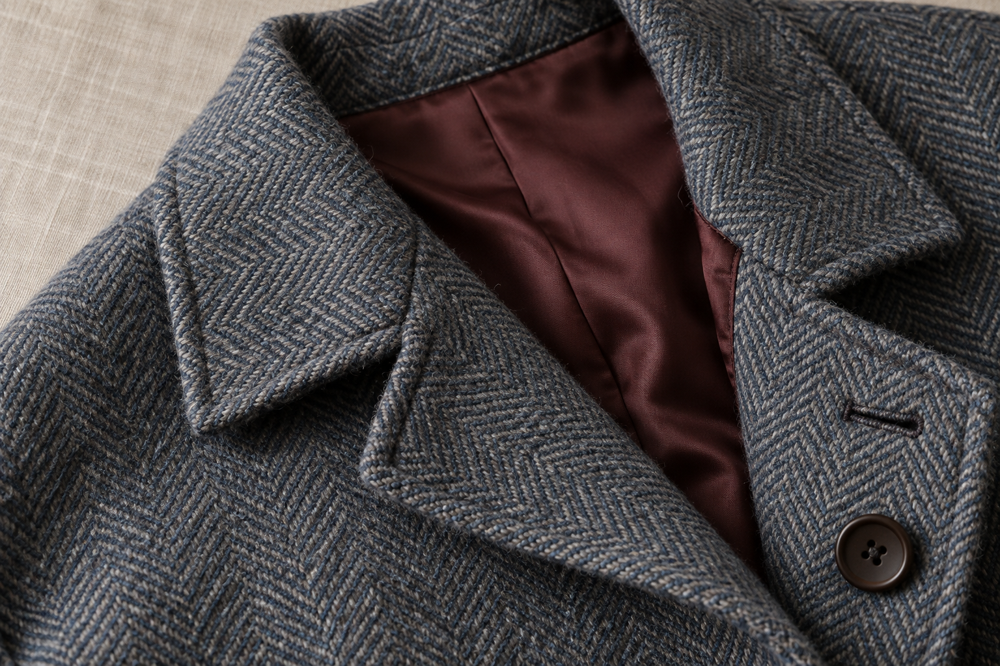

# 服装材质细节

[返回分类](../README.md)

状态：已配图。类型：直接生图。风格：时装编辑摄影。

粗花呢外套领口与内衬细节

核心机制：局部特写体现纤维、缝线与垂坠关系

## 对应结果



## 提示词

```text
创作横幅 3:2 的服装细节摄影，原创灰蓝人字纹粗花呢大衣的领口与内衬特写。大衣放在无字亚麻台面，翻领从左上向中间展开，内侧露出深酒红平滑里布，右下可见一枚哑光深棕圆扣及整齐扣眼。外层羊毛纤维、人字纹方向、领边缝线和内衬接缝清楚可辨，材料厚薄与折叠重量可信，左侧柔光，不磨平纤维或过度锐化。画面不出现完整模特、标签文字、真实品牌、尺子或水印。
```

## 检查

纤维尺度合理；缝线跟随裁片

灰蓝人字纹面料、酒红里布、棕色纽扣与扣眼均可辨，近景纤维和缝线清楚，衣领结构自然。

[生成与检查记录](entry.json) · [提示词原文](prompt.md)

许可：[CC BY 4.0](../../../docs/licensing.md)。
