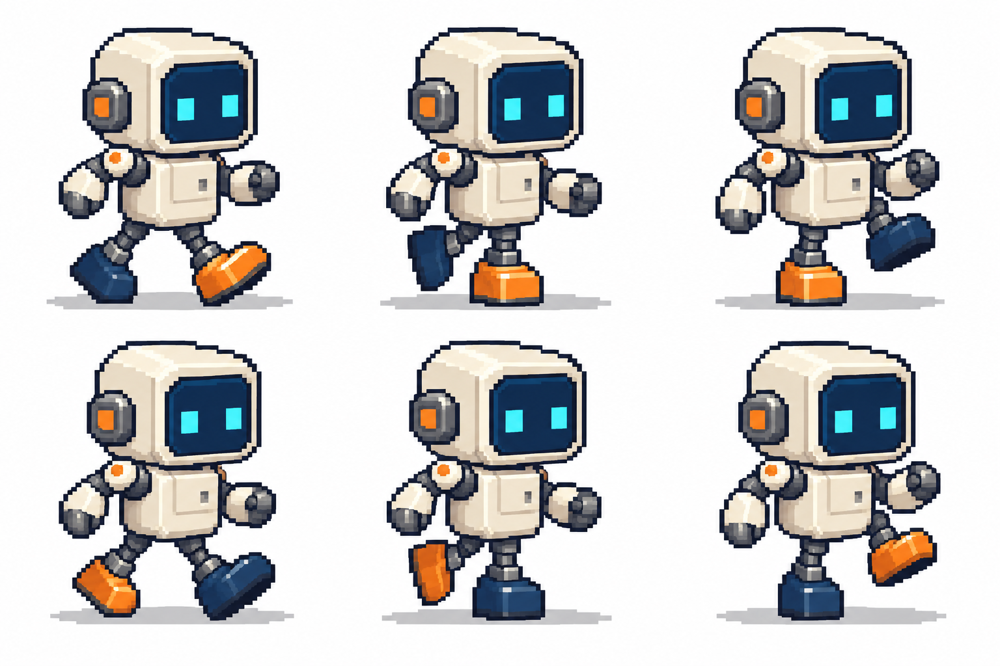

# 角色动作精灵图

[返回分类](../README.md)

状态：已配图。类型：参考图引导生成。风格：像素画。

原创小型机器人行走的六帧草案

核心机制：相邻帧保持体积并体现动作相位

## 对应结果



## 输入图片

输入 1：原创像素机器人角色参考


## 提示词

```text
Create a crisp pixel-art six-frame robot walking animation study, landscape 3:2, exactly three columns and two rows. Use input image 1 for the cream square head and body, navy face screen, two cyan square eyes, stubby mechanical limbs, proportions and pixel style. Make one deliberate design variation to identify the legs: the NEAR boot is BRIGHT ORANGE, the FAR boot is DARK NAVY BLUE. Keep those two boot colors attached to the same legs in all six frames. Each cell contains one whole robot facing right, same camera and scale, white background and aligned ground.
The top row depicts the ORANGE boot's support phase; the bottom row depicts the NAVY boot's support phase. The leg silhouettes and their color positions must visibly alternate between the two rows.
Top left: orange boot extended to the RIGHT on its heel; navy boot stretched to the LEFT on its toe. Top middle: orange boot flat under the body, orange leg bent low; navy boot lifted off the ground behind to the LEFT. Top right: orange boot on the ground under the body; navy knee lifted high in front to the RIGHT.
Bottom left: NAVY boot extended to the RIGHT on its heel; ORANGE boot stretched to the LEFT on its toe. Bottom middle: NAVY boot flat under the body, navy leg bent low; ORANGE boot lifted behind to the LEFT. Bottom right: NAVY boot on the ground under the body; ORANGE knee lifted high in front to the RIGHT.
Arms counter-swing with the legs. Preserve one orange boot and one navy boot in every frame. No repeated poses, text, numbers, glow or watermarks. This is an animation planning illustration, not a ready-to-import sprite atlas.
```

## 检查

脚步顺序连续；最终资产需检查帧对齐

六格用橙色与深蓝色靴区分前伸、支撑和抬腿阶段，头身比例与像素风格连续；上下半周期的手臂摆动区别较弱，未做逐帧动画播放和引擎对齐验证。

[生成与检查记录](entry.json) · [提示词原文](prompt.md)

许可：[CC BY 4.0](../../../docs/licensing.md)。
