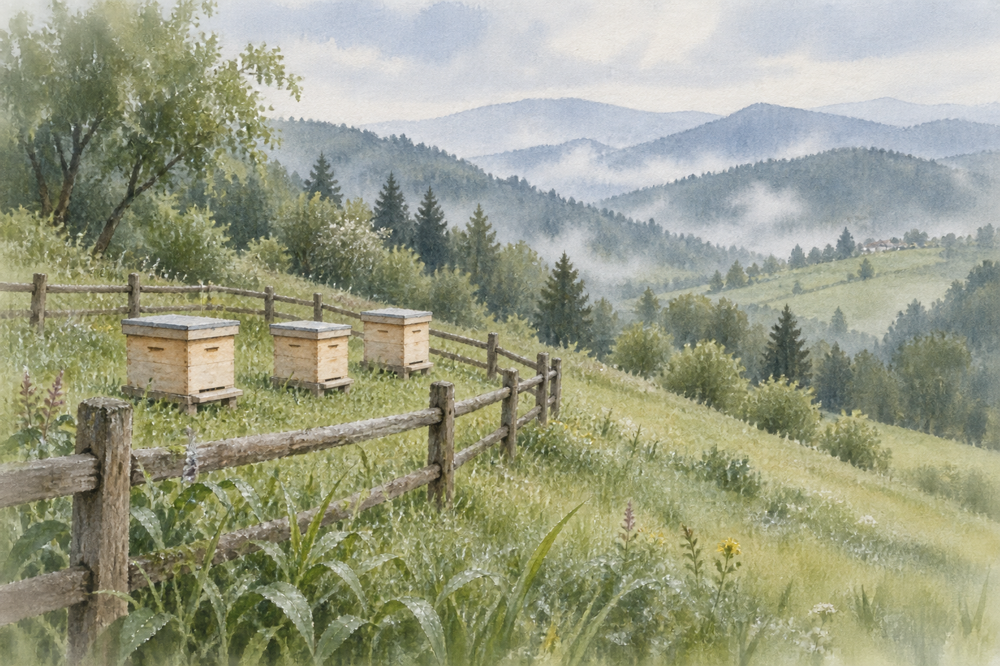

# 透明水彩风景

[返回分类](../README.md)

状态：已配图。类型：直接生图。风格：水彩。

雨后的山坡蜂场与木栅栏

核心机制：透明叠色与纸白共同塑造空间

## 对应结果



## 提示词

```text
画一张横幅 3:2 的透明水彩风景。场景是雨后安静的山坡蜂场，低矮的木栅栏从左下角斜向延伸到画面中部，栅栏内整齐放着三只浅木色蜂箱，远处是柔和起伏的山坡与湿润树丛。画面中不出现人物。

用真正的水彩视觉语言：透明薄层叠色，纸面自然留白，湿画法的柔边与少量干笔细节并存。前景草叶和木栅栏略清晰，中景蜂箱由简洁色块建立体积，远山依靠淡蓝灰与纸白形成空气感。树叶的绿色有冷暖变化，雨后的光线柔和，天空只用很淡的灰蓝色洗染。

保留可感知的水彩纸纹理，画面轻盈、有呼吸感，不要用油画厚涂、硬质三维渲染、摄影滤镜或黑色描边代替水彩。蜂箱恰好三只，结构简洁可信，栅栏和山坡透视协调。不要文字、签名、边框或水印。
```

## 检查

有水彩渗化和留白；不变为油画厚涂

画面恰好三只蜂箱。已检查透明叠色、纸面纹理、远山空气感及栅栏透视，保留水彩的柔边与前景细节。

[生成与检查记录](entry.json) · [提示词原文](prompt.md)

许可：[CC BY 4.0](../../../docs/licensing.md)。
