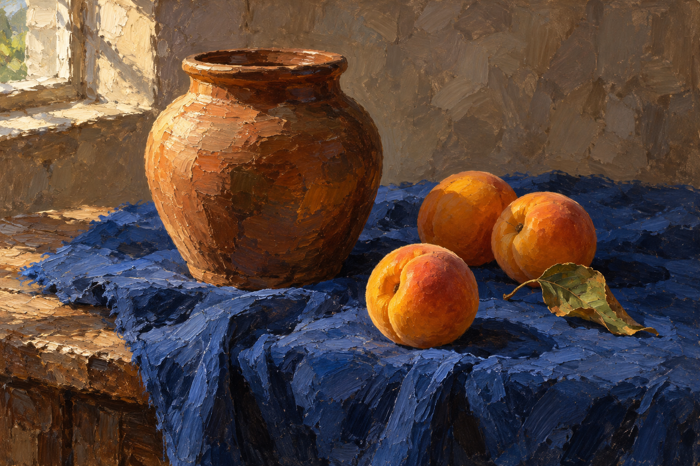

# 厚涂油画静物

[返回分类](../README.md)

状态：已配图。类型：直接生图。风格：厚涂油画。

蓝布上的陶罐和成熟杏子

核心机制：可见笔触与颜料堆叠形成体积

## 对应结果



## 提示词

```text
创作横幅 3:2 的厚涂油画静物。旧木桌铺一块深钴蓝棉布，中央偏左一只温润赭色陶罐，右侧三枚成熟杏子，其中一枚略靠前，另有一片卷曲杏叶。左上窗光形成温暖高光和深而透明的阴影。用可见的厚颜料笔触塑造罐身、杏皮和布褶，前景笔触较厚，背景为克制的暖灰褐墙面。物体重心稳定，接触阴影明确，保留油画肌理与色块转折，不做照片质感、不加餐具、文字、签名或水印。
```

## 检查

厚薄笔触有层次；物体结构仍清楚

陶罐、钴蓝布和三枚杏子形成静物组，厚涂笔触和侧光明确，接触关系自然。

[生成与检查记录](entry.json) · [提示词原文](prompt.md)

许可：[CC BY 4.0](../../../docs/licensing.md)。
