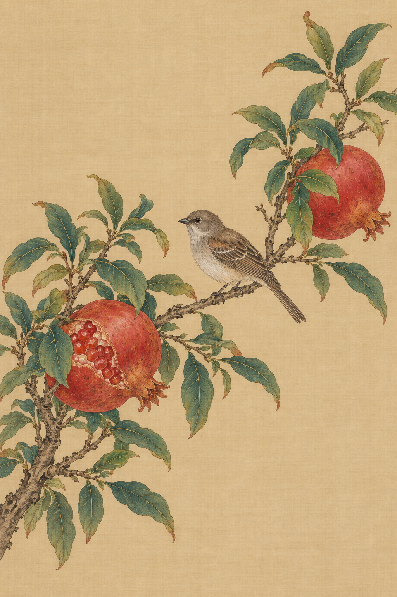

# 工笔动植物

[返回分类](../README.md)

状态：已配图。类型：直接生图。风格：工笔重彩。

石榴枝与停栖的小型鸣禽

核心机制：精细线描与分层敷色表现形态

## 对应结果



## 提示词

```text
画竖幅 2:3 的工笔重彩花鸟作品。一枝石榴从左下伸向右上，细枝结构连续，长椭圆叶疏密有致，枝上两枚成熟红石榴，其中一枚露出少量籽粒；一只原创自然形态的小型灰褐雀鸟侧身栖在横枝上，双足握枝，尾羽完整。暖米色绢本背景，勾线细匀，叶片分染、果皮朱红层染，羽毛细密但不过度锐化。主体留出呼吸空间，保持传统工笔重彩风格，不添加第二只鸟、题字、印章、签名或水印。
```

## 检查

线条连贯；叶脉和羽毛尺度合理

两枚石榴与单只雀鸟数量正确，勾线和绢本层染清楚，鸟足落在连续枝条上。

[生成与检查记录](entry.json) · [提示词原文](prompt.md)

许可：[CC BY 4.0](../../../docs/licensing.md)。
