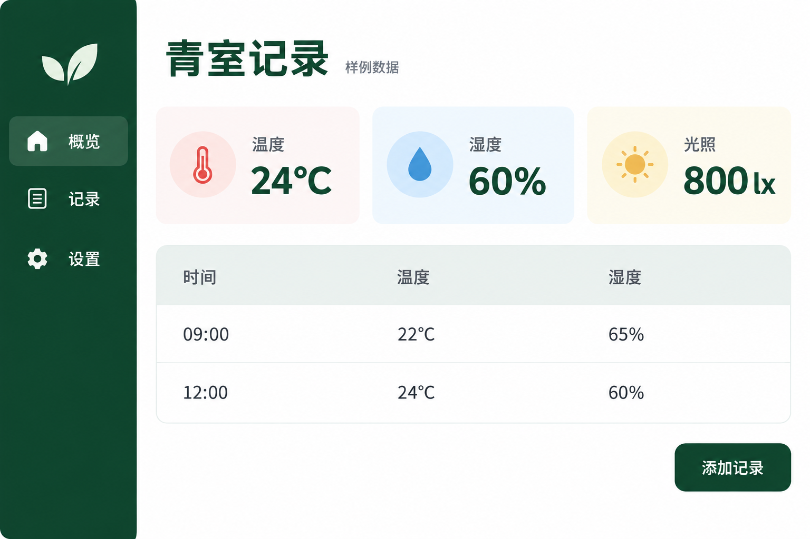

# 桌面工作面板

[返回分类](../README.md)

状态：已配图。类型：直接生图。风格：简洁界面。

虚构小型温室管理桌面面板

核心机制：多个模块在同一网格内表达工作状态

## 对应结果



## 提示词

```text
设计横幅 3:2 的原创温室管理桌面仪表盘静态界面，白底、深绿侧栏、清楚的现代中文无衬线字。页面标题「青室记录」，旁边小字「样例数据」。左侧导航只有「概览」「记录」「设置」。主区顶部三张同宽指标卡依次写「温度 24°C」「湿度 60%」「光照 800 lx」。下方一张记录表，表头「时间」「温度」「湿度」，两行数据严格为「09:00｜22°C｜65%」「12:00｜24°C｜60%」。右下一个按钮「添加记录」。统一圆角与留白，文字层级清楚，不加趋势箭头、额外数据、真实品牌或水印。只画界面，不画电脑外壳。
```

## 检查

数值按给定示例；模块尺度统一

三张指标卡和两行记录的数据、单位均对应提示，导航与添加记录按钮文案正确，样例数据标记可读。

[生成与检查记录](entry.json) · [提示词原文](prompt.md)

许可：[CC BY 4.0](../../../docs/licensing.md)。
