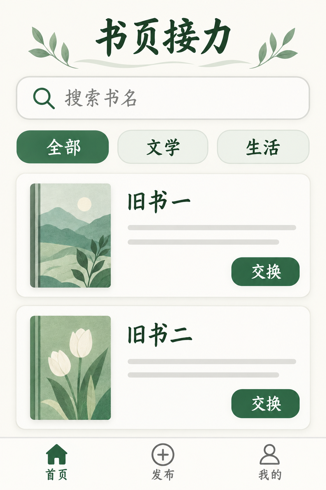
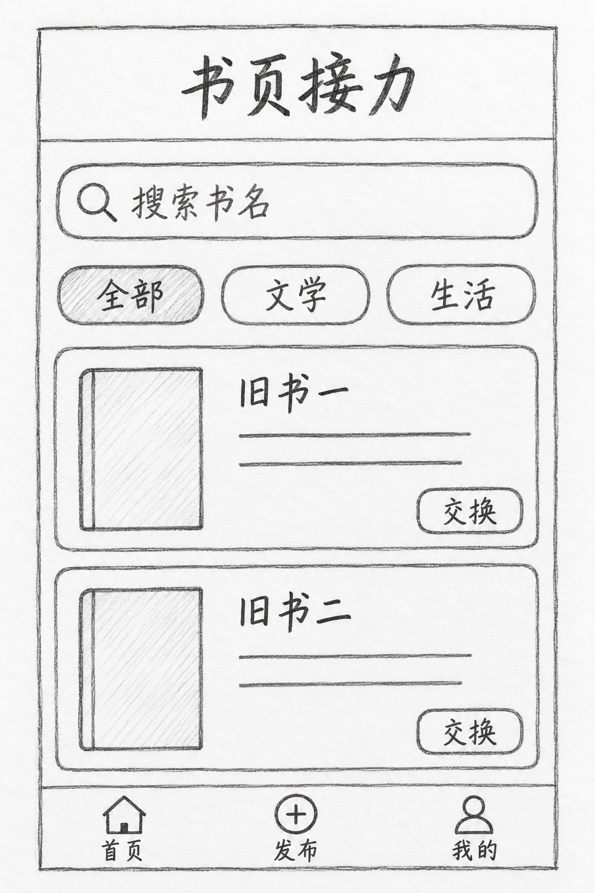

# 草图转界面概念

[返回分类](../README.md)

状态：已配图。类型：参考图引导生成。风格：简洁界面。

自绘旧书交换应用首页草图

核心机制：保留草图信息布局并提升视觉细节

## 对应结果



## 输入图片

输入 1：原创界面草图与区块布局



## 提示词

```text
使用输入图 1 的原创「书页接力」线框草图，生成竖幅 2:3 的完整移动应用视觉稿。严格保留原有区块顺序与功能位置：顶部「书页接力」，下面搜索框「搜索书名」，再下三标签「全部」「文学」「生活」，中部两张图书卡「旧书一」「旧书二」，每卡有一个原创无字封面与「交换」按钮，底部导航「首页」「发布」「我的」。把铅笔框线转为暖白底、墨绿主色与浅灰分隔的现代中文界面，统一圆角、间距和字重。不能增删卡片、改文案或重排导航，不添加真实封面、手机边框或水印。
```

## 检查

功能块位置对应；不擅自删减区域

搜索、三标签、两张图书卡及底部导航的顺序对应草图，按钮和标题文案正确；字体保留了部分手写感，顶部另有枝叶装饰。

[生成与检查记录](entry.json) · [提示词原文](prompt.md)

许可：[CC BY 4.0](../../../docs/licensing.md)。
