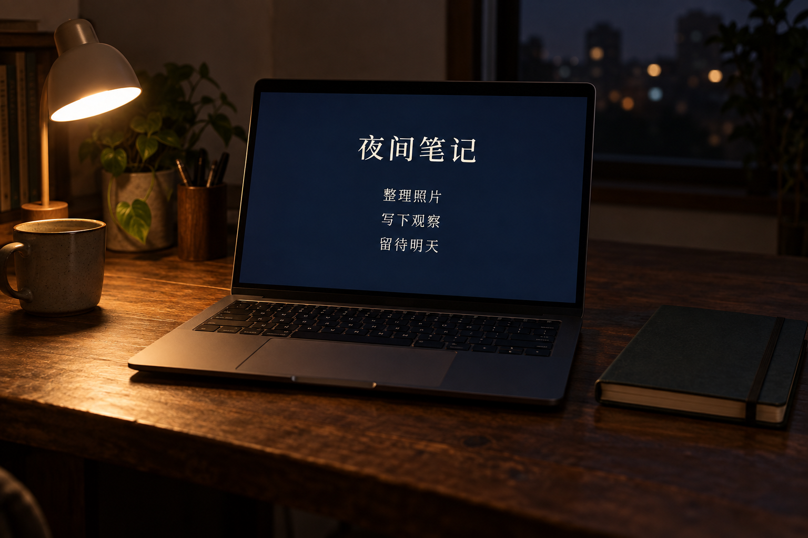

# 实体屏幕拍摄

[返回分类](../README.md)

状态：已配图。类型：直接生图。风格：自然写实摄影。

夜晚桌面上显示虚构笔记应用的电脑

核心机制：屏幕内容、透视和环境反光形成真实观看情境

## 对应结果



## 提示词

```text
生成横幅 3:2 的夜间书桌自然摄影，中央一台无品牌笔记本电脑，屏幕正面略斜但文字清楚。屏幕显示原创极简笔记应用，深蓝背景、米白字，标题「夜间笔记」，下方仅三行：「整理照片」「写下观察」「留待明天」。屏幕界面平整，不被强反光覆盖，周围低亮环境由左侧一盏暖白小台灯照明，键盘与桌沿保留细节；右侧一本合拢无字笔记本。桌面深木色，安静克制，文字逐字正确。不加真实系统图标、商标、额外屏幕、人物或水印。
```

## 检查

屏幕文字可读；反光不遮挡主内容

笔记本屏幕上的标题与三行文字清楚，左侧台灯和右侧闭合笔记本位置正确，暖光与深蓝屏幕形成夜间场景。

[生成与检查记录](entry.json) · [提示词原文](prompt.md)

许可：[CC BY 4.0](../../../docs/licensing.md)。
