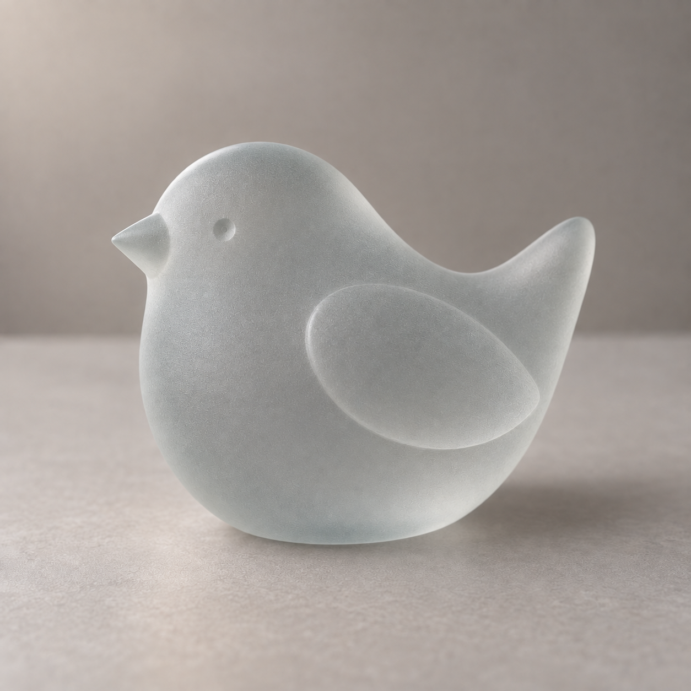

# 材质变形与超现实创意

[返回首页](../../README.md) · [使用方法](../../docs/usage.md)

规划 17 个选题，图库案例 1 条。点击已制作的条目可查看完整提示词与图片。

| 编号 | 场景 | 类型 | 风格 | 状态 | 批次 |
|---|---|---|---|---|---|
| SC-193 | [原物玻璃化](SC-193/README.md) | 编辑现有图片 | 玻璃三维 | 已配图 | 试制 |
| SC-194 | 金属镀层重塑 | 编辑现有图片 | 金属三维 | 规划中 | 首批补充 |
| SC-195 | 针织软雕塑 | 参考图引导生成 | 针织 | 规划中 | 首批补充 |
| SC-196 | 毛绒物件转化 | 参考图引导生成 | 毛绒 | 规划中 | 首批补充 |
| SC-197 | 充气物件转化 | 参考图引导生成 | 充气塑料 | 规划中 | 首批补充 |
| SC-198 | 折纸物件转化 | 参考图引导生成 | 折纸 | 规划中 | 扩展 |
| SC-199 | 云朵物象 | 直接生图 | 超现实摄影 | 规划中 | 扩展 |
| SC-200 | 液体跨画面边界 | 直接生图 | 超现实摄影 | 规划中 | 扩展 |
| SC-201 | 递归画面结构 | 直接生图 | 超现实摄影 | 规划中 | 扩展 |
| SC-202 | 城市巨物尺度 | 直接生图 | 超现实摄影 | 规划中 | 扩展 |
| SC-203 | 软硬材质置换 | 编辑现有图片 | 商业棚拍 | 规划中 | 扩展 |
| SC-204 | 植物与机械融合 | 直接生图 | 蒸汽机械幻想 | 规划中 | 扩展 |
| SC-205 | 内部世界剖露 | 直接生图 | 超现实摄影 | 规划中 | 扩展 |
| SC-206 | 形状语义转换 | 直接生图 | 几何抽象 | 规划中 | 扩展 |
| SC-207 | 黏土形态转化 | 参考图引导生成 | 黏土 | 规划中 | 扩展 |
| SC-208 | 簇绒图案转化 | 参考图引导生成 | 簇绒 | 规划中 | 扩展 |
| SC-209 | 石雕材质转化 | 参考图引导生成 | 石雕 | 规划中 | 扩展 |

## 配图预览

### 原物玻璃化

[查看提示词](SC-193/README.md)

