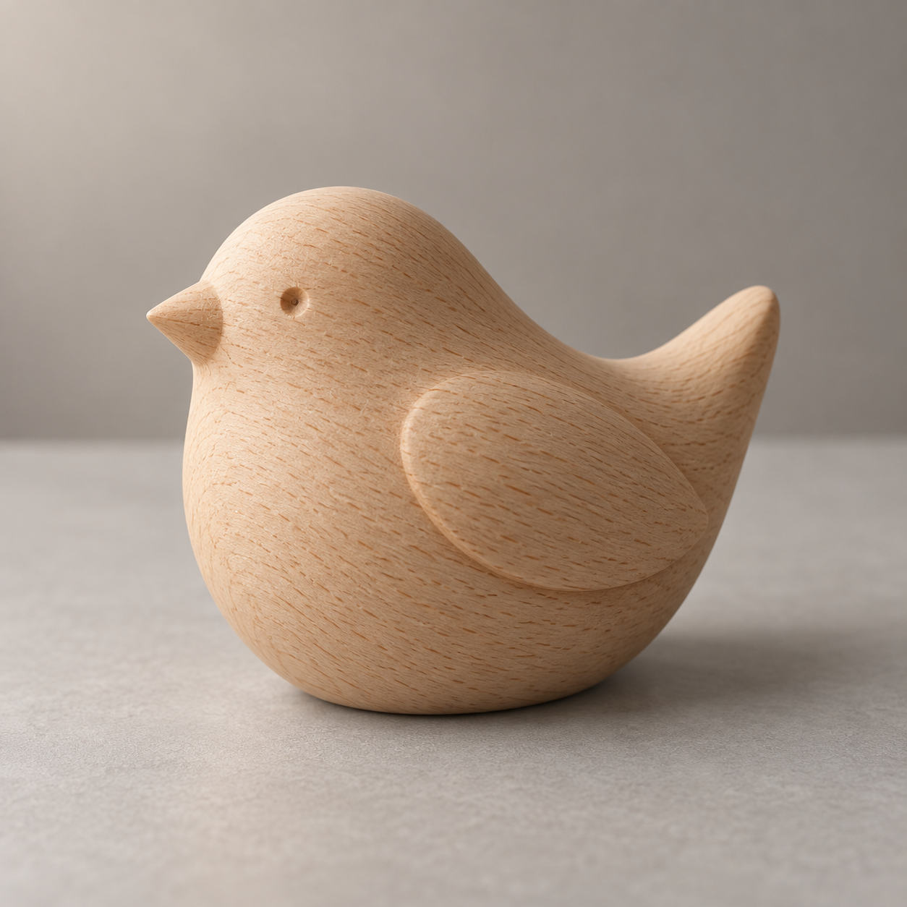

# 原物玻璃化

[返回分类](../README.md)

状态：已配图。类型：编辑现有图片。风格：玻璃三维。

把自制木雕鸟变为磨砂玻璃摆件

核心机制：保持原物轮廓并将表面改为透光材质

## 对应结果


## 输入图片

输入 1：待编辑的原创木雕小鸟照片



## 提示词

```text
编辑输入图 1：把画面中央的木雕小鸟改成同一外形的磨砂玻璃摆件，保持参考图的正方形画幅与摄影构图。

仅改变小鸟本体的材质表现：木纹消失，替换为轻微青灰色的半透明磨砂玻璃。保持小鸟的头部、尖喙、圆润躯干、翅膀浅浮雕、短尾和底部接触面的原有轮廓、尺寸、朝向与位置。不要增添真实羽毛、脚爪、眼珠、花纹或配件。

玻璃薄处更透光，厚处略深，边缘有克制的柔亮反射，磨砂表面均匀细腻。透光、折射与内部明暗应符合一个有厚度的实心玻璃摆件，不呈现透明塑料、金属镜面或空洞容器。接触阴影可随玻璃材质适度变浅，但仍与桌面接触自然。

保留输入图中的桌面、背景、相机位置、光线方向和景深，不移动摆件或重新布置画面。不增加文字、水印、额外物体或新的环境。
```

## 检查

外形不变；透光与厚度相容

已对照小鸟的尖喙、凹点眼睛、浅浮雕翅膀、短尾和底部轮廓，摆件的位置与背景构图保留。木纹替换为乳浊磨砂玻璃质感，薄边更亮，接触阴影相应变浅；未增加第二件物体。

[生成与检查记录](entry.json) · [提示词原文](prompt.md)

许可：[CC BY 4.0](../../../docs/licensing.md)。
