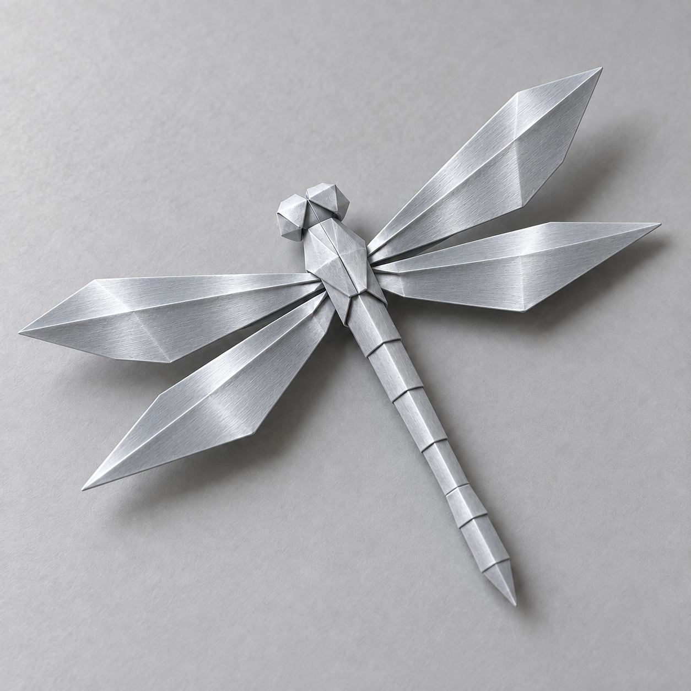
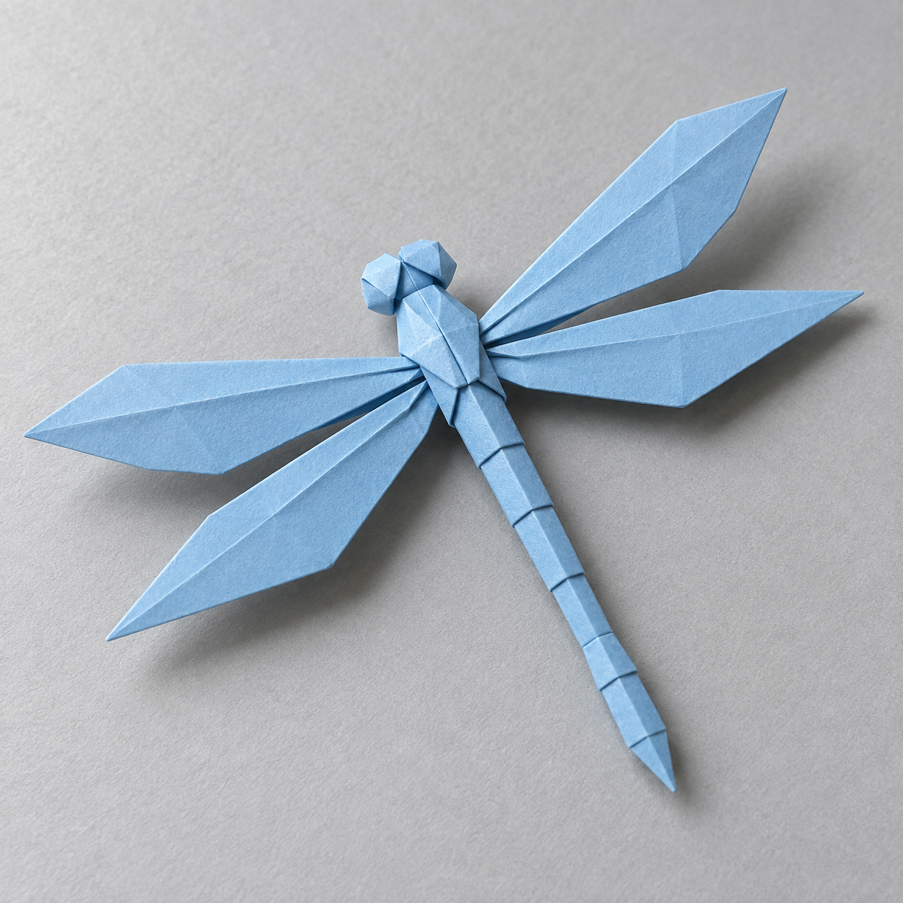

# 金属镀层重塑

[返回分类](../README.md)

状态：已配图。类型：编辑现有图片。风格：金属三维。

把自制折纸蜻蜓转为金属工艺品

核心机制：保留结构并让反射随曲面连续变化

## 对应结果



## 输入图片

输入 1：待编辑的原创折纸蜻蜓



## 提示词

```text
编辑输入图 1 的原创浅蓝折纸蜻蜓，把纸张材质替换为薄层拉丝银色金属。严格保留原有正方形构图、四片翅膀的外轮廓与夹角、头部、分段长尾、所有主要折线和相机方向。原折线变成金属折弯线，平面有细腻同向拉丝，高光沿折边变化，阴影仍落在原浅灰背景上。只改变材质与相应反射，不增加机械零件、腿、第五片翅膀、文字或水印。
```

## 检查

折痕结构保留；反射不穿透实体

四翼轮廓、夹角、头部与分段尾的位置和输入一致，纸面转为拉丝银色金属，主要折线及浅灰背景保留，未增加零件。

[生成与检查记录](entry.json) · [提示词原文](prompt.md)

许可：[CC BY 4.0](../../../docs/licensing.md)。
