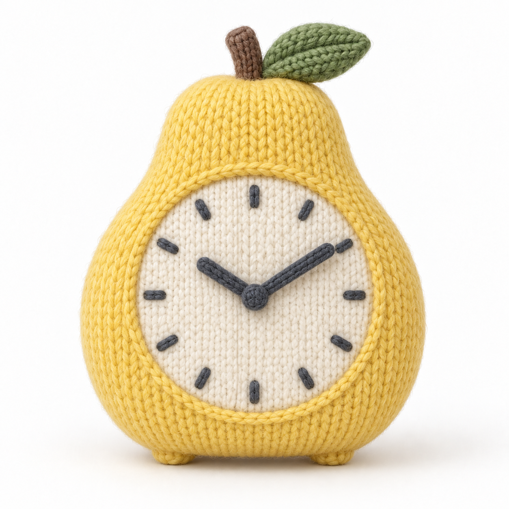
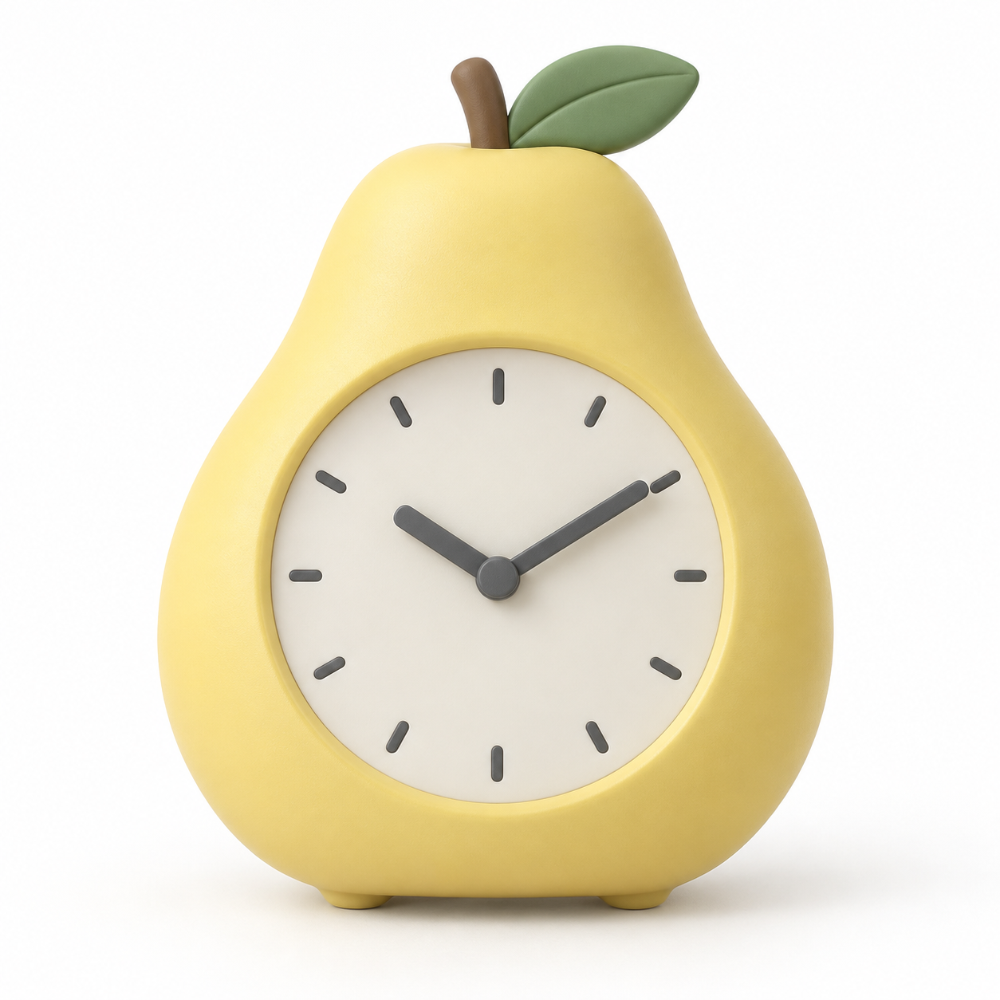

# 针织软雕塑

[返回分类](../README.md)

状态：已配图。类型：参考图引导生成。风格：针织。

将原创梨形闹钟设计成针织摆件

核心机制：轮廓用针脚、填充和接缝重新构成

## 对应结果



## 输入图片

输入 1：原创梨形闹钟形状参考



## 提示词

```text
使用输入图 1 的原创梨形闹钟作为形状参考，生成方形的针织软物概念棚拍。保留梨形黄色外轮廓、顶部棕色短梗和绿色叶片、正面圆形米白钟面、十二个深灰刻度和约 10:10 的两根指针。把壳体、叶片、刻度与指针都转译为紧实毛线针织，针脚沿体积弯曲，柔软填充稍鼓起但不失识别。暖白无缝背景、均匀柔光、细小绒毛可见。只出现一只完整闹钟，不加真实品牌、文字、手脚或水印。
```

## 检查

针脚尺度一致；主体仍可识别

梨形外轮廓、叶片、短梗及底部支撑延续输入，钟面十二刻度和两根指针清楚，时间约为 10:10，针织纹理沿体积变化。

[生成与检查记录](entry.json) · [提示词原文](prompt.md)

许可：[CC BY 4.0](../../../docs/licensing.md)。
