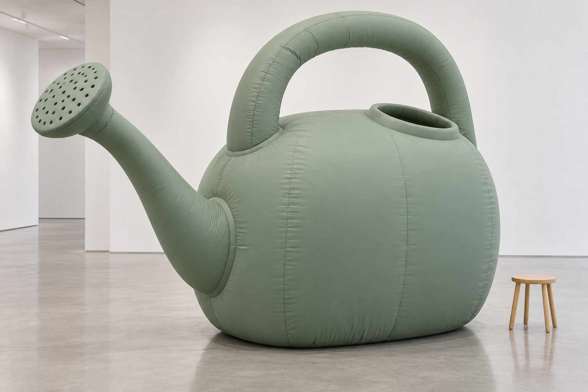
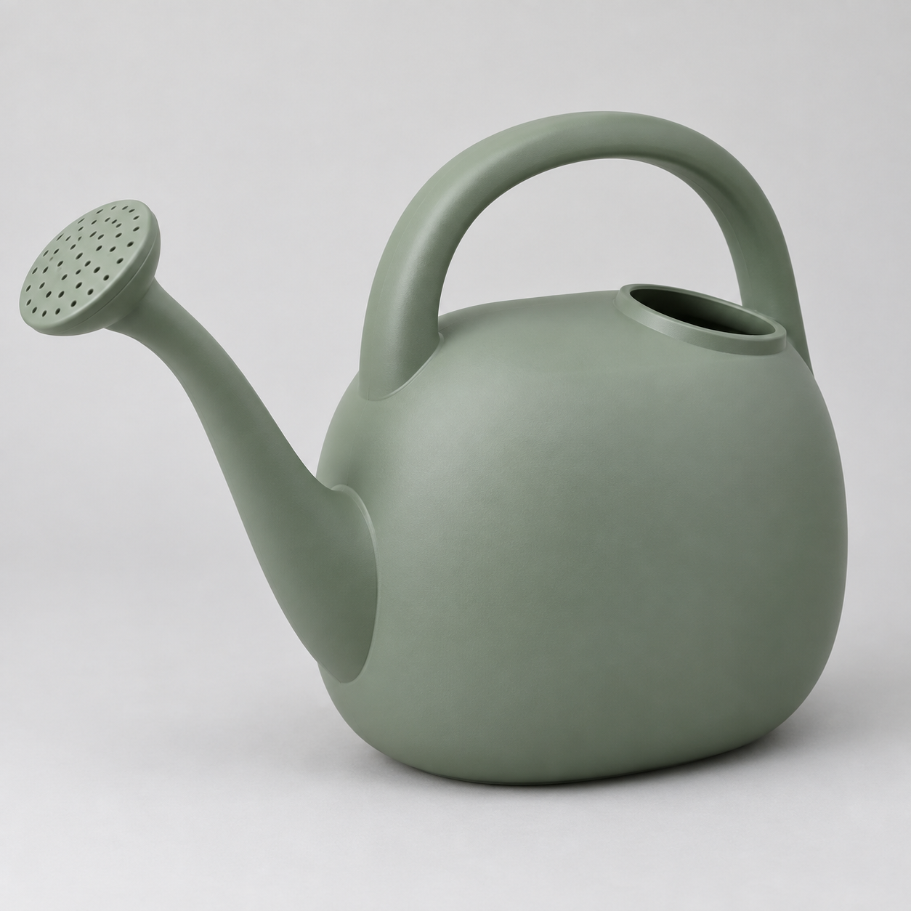

# 充气物件转化

[返回分类](../README.md)

状态：已配图。类型：参考图引导生成。风格：充气塑料。

将原创水壶轮廓转为充气装置

核心机制：气腔、焊缝和膜面高光形成充气结构

## 对应结果



## 输入图片

输入 1：原创浇水壶形状参考



## 提示词

```text
使用输入图 1 的原创绿色浇水壶作为形状与颜色参考，生成横幅 3:2 的大型充气装置摄影。装置放在干净室内展厅地面，保留椭圆壶身、上方拱形提手、向左延伸的长壶嘴和圆喷头、上部加水口，按输入相机方向。整体是鼠尾草绿充气织物，轮廓圆润，纵向接缝沿壶身体积，提手与壶嘴连接处有可信环形缝合，底部略压扁接地。旁边只用一只普通小木凳提供尺度，不加人物、绳索、文字或水印。展厅柔光，充气张力与材质清楚。
```

## 检查

焊缝跟随形体；材质保持一致

浇水壶轮廓、左侧喷头、拱形提手及加水口清楚，充气织物有接缝和底部压缩，小木凳提供尺度参照。

[生成与检查记录](entry.json) · [提示词原文](prompt.md)

许可：[CC BY 4.0](../../../docs/licensing.md)。
