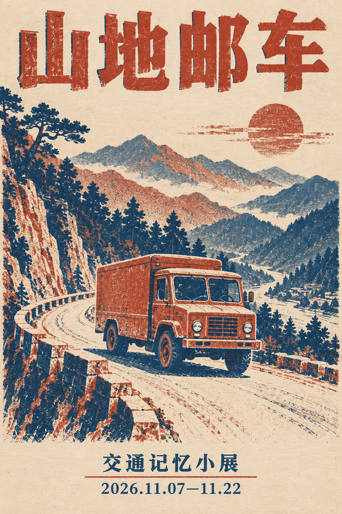

# 复古限色印刷海报

[返回分类](../README.md)

状态：已配图。类型：直接生图。风格：复古印刷。

虚构山地邮车主题展的双色海报

核心机制：套色偏移与纸纹形成稳定年代语言

## 对应结果



## 提示词

```text
设计竖幅 2:3 的复古双色印刷海报，主题为虚构展览「山地邮车」。只用砖红和深墨蓝两种油墨，纸张为米白，叠印和轻微套色偏移带来旧印刷质感。大标题「山地邮车」置顶；中央画一辆原创方正邮车沿山间弯道行驶，车身无字，远处是简洁叠层山峰。底部只写两行：「交通记忆小展」「2026.11.07—11.22」。所有文案逐字准确，底部字保持清楚，构图稳定，留白充足。不增加第三种油墨、英文、真实邮政标志、二维码或水印。
```

## 检查

限色数量受控；正文仍可读

标题、展名和日期正确，砖红与深蓝套色形成复古印刷质感，邮车和山路构图清楚。

[生成与检查记录](entry.json) · [提示词原文](prompt.md)

许可：[CC BY 4.0](../../../docs/licensing.md)。
