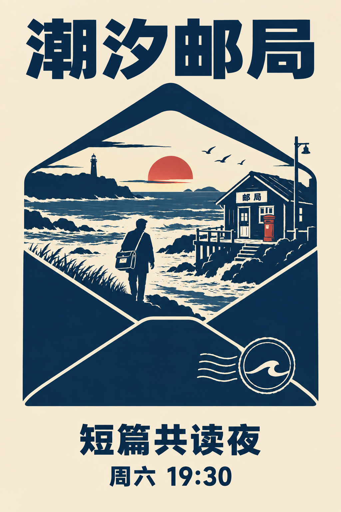

# 剪影叙事海报

[返回分类](../README.md)

状态：已配图。类型：直接生图。风格：平面剪影。

原创短篇「潮汐邮局」的阅读活动海报

核心机制：轮廓内的第二场景揭示故事信息

## 对应结果



## 提示词

```text
设计竖幅 2:3 的原创阅读活动海报，采用平面剪影风格，暖米色底、深靛蓝主体、一点朱红。中央大轮廓是一只直立信封，信封内部以负形剪影表现海岸、小木邮局、潮水和一位提邮包的成年人物；外部信封轮廓完整，内部故事有清楚前后层次。顶部大字只写「潮汐邮局」，底部只写「短篇共读夜」和「周六 19:30」。使用清晰中文黑体，图形不遮挡文字。只出现一位人物、一间邮局，不加照片纹理、额外文案、二维码或水印。
```

## 检查

主轮廓和内部叙事各自可辨

信封外轮廓包含海岸邮局场景，单个人物与主文案可读。屋檐另有「邮局」小标牌，属于生成时增加的场景细节。

[生成与检查记录](entry.json) · [提示词原文](prompt.md)

许可：[CC BY 4.0](../../../docs/licensing.md)。
