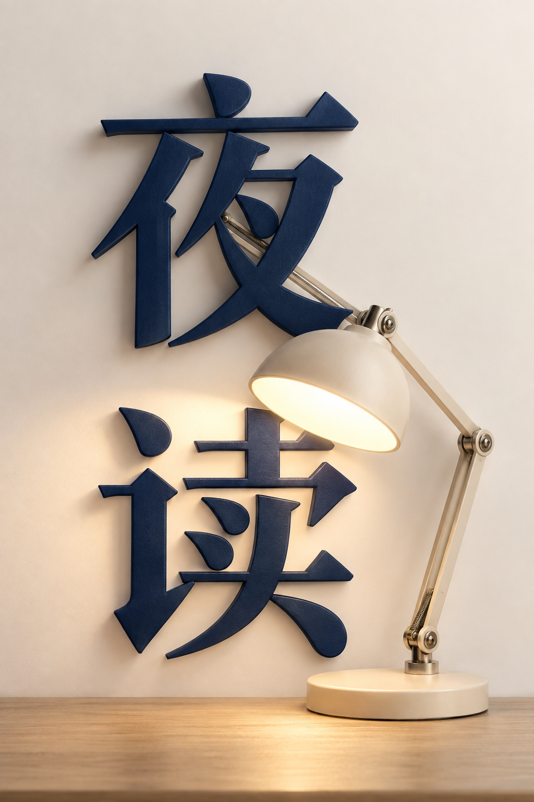

# 大字与实物融合

[返回分类](../README.md)

状态：已配图。类型：直接生图。风格：超现实摄影。

可折叠台灯穿过「夜读」两字的海报

核心机制：三维物体与主标题共享空间遮挡

## 对应结果



## 提示词

```text
设计竖幅 2:3 的超现实摄影文字海报。暖白背景，深蓝立体中文字「夜读」上下排列，字形保留完整、容易辨认。右侧一盏原创米白可折叠台灯，以真实金属铰链与重力姿态穿过两字之间的留白：灯臂位于文字后方，圆形灯罩探到「读」字前方，底座放在画面底部桌面上。暖灯光照亮少量文字表面，前后遮挡清楚，不能切掉汉字关键笔画。只出现「夜读」这两个字和一盏台灯，留白充足，不增加口号、英文、其他物品或水印。
```

## 检查

标题字形完整；前后关系连贯

「夜读」关键笔画可辨，台灯与文字前后遮挡清楚，灯臂连接和底座落点合理。

[生成与检查记录](entry.json) · [提示词原文](prompt.md)

许可：[CC BY 4.0](../../../docs/licensing.md)。
