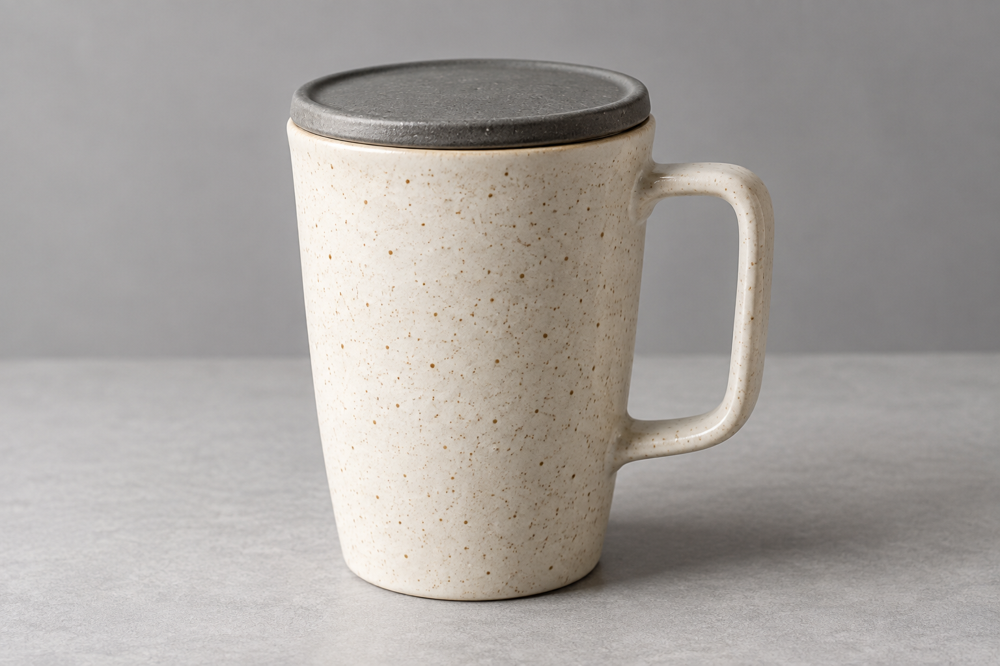

# 棚拍商品主图

[返回分类](../README.md)

状态：已配图。类型：参考图引导生成。风格：商业棚拍。

将自制无品牌陶瓷随行杯置于暖灰背景

核心机制：保持产品外形并重建背景与布光

## 对应结果


## 输入图片

输入 1：原创陶瓷随行杯，产品形状与材质参考



## 提示词

```text
使用输入图 1 作为产品外形参考，生成一张横幅 3:2 的专业棚拍商品主图。唯一产品是参考图中的手工陶瓷随行杯。

严格保留杯身比例、杯口厚度、盖子的结构、单个把手的形状与连接位置，以及釉色和表面细小斑点。可以调整拍摄角度，让杯子以清晰的前侧三分之四视角完整展示。杯子位于画面中央略偏右，四周留白，杯体占画面高度约三分之二。

背景是无接缝的暖灰色棚拍背景，桌面与背景自然过渡。左上方的大面积柔光勾勒杯身曲面，右侧有轻微补光。产品下方呈现自然、柔软的接触阴影，釉面高光不过曝，杯口、盖子与把手边缘清楚。以真实陶瓷摄影表现厚度、细小釉斑和手工质感。

只展示一只杯子，不加入包装、标签、植物、文字、手、第二件产品或水印，不把把手改成其他形状。
```

## 检查

杯口与把手形状一致；边缘和阴影清楚

已对照杯身轮廓、单把手连接、深灰杯盖与奶油色釉斑。结果只有一只完整杯子，留白与接触阴影适合商品展示；釉斑为生成细节，不作为逐点复制记录。

[生成与检查记录](entry.json) · [提示词原文](prompt.md)

许可：[CC BY 4.0](../../../docs/licensing.md)。
