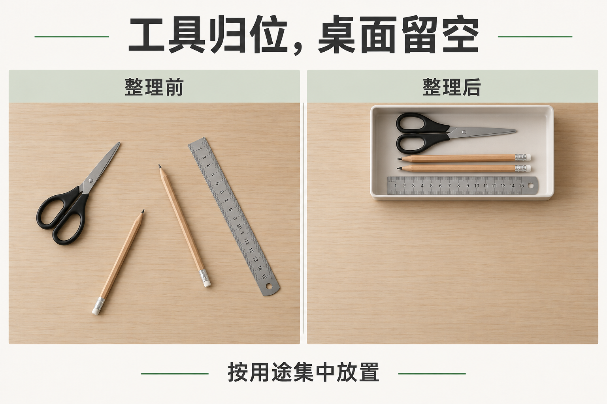
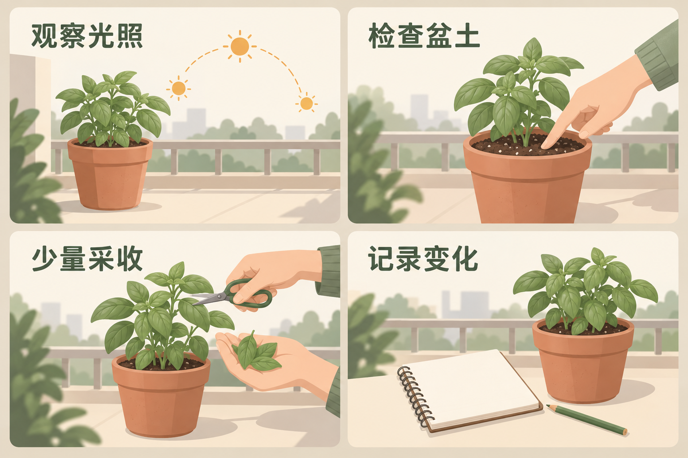

# 社交卡片与趣味内容

[返回首页](../../README.md) · [使用方法](../../docs/usage.md)

规划 11 个选题，图库案例 6 条。点击已制作的条目可查看完整提示词与图片。

| 编号 | 场景 | 类型 | 风格 | 状态 | 批次 |
|---|---|---|---|---|---|
| SC-075 | [短句人物卡片](SC-075/README.md) | 直接生图 | 扁平矢量插画 | 已配图 | 试制 |
| SC-076 | [知识对照卡片](SC-076/README.md) | 直接生图 | 瑞士网格排版 | 已配图 | 首批补充 |
| SC-077 | [多页社交内容预览](SC-077/README.md) | 直接生图 | 扁平矢量插画 | 已配图 | 首批补充 |
| SC-078 | [虚构动态消息板](SC-078/README.md) | 直接生图 | 简洁界面 | 已配图 | 首批补充 |
| SC-079 | [复古照片拼贴卡](SC-079/README.md) | 参考图引导生成 | 拼贴手账 | 已配图 | 首批补充 |
| SC-080 | [宠物拟人对话](SC-080/README.md) | 直接生图 | 风格化三维 | 已配图 | 首批补充 |
| SC-081 | 天气场景卡片 | 直接生图 | 等距三维 | 规划中 | 扩展 |
| SC-082 | 个人进度记录卡 | 直接生图 | 瑞士网格排版 | 规划中 | 扩展 |
| SC-083 | 视觉寻物挑战 | 直接生图 | 细节叙事插画 | 规划中 | 扩展 |
| SC-084 | 知识主题视频封面 | 直接生图 | 高饱和波普 | 规划中 | 扩展 |
| SC-085 | 透明感个人资料卡 | 直接生图 | 玻璃三维 | 规划中 | 扩展 |

## 配图预览

### 短句人物卡片

[查看提示词](SC-075/README.md)

### 知识对照卡片

[查看提示词](SC-076/README.md)

### 多页社交内容预览

[查看提示词](SC-077/README.md)

### 虚构动态消息板

[查看提示词](SC-078/README.md)

### 复古照片拼贴卡

[查看提示词](SC-079/README.md)

### 宠物拟人对话

[查看提示词](SC-080/README.md)

